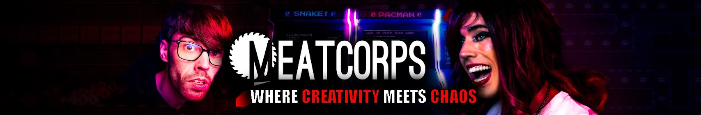

# Welcome to the unofficial Raylib-cs practical guide

**Important notice:** This guide is still a work in progress.  
If you find errors or have suggestions, please open an issue on GitHub. 

[GitHub issue page](https://github.com/meatcorps/Documentation/issues)

[Reddit](https://www.reddit.com/r/Meatcorps)

[YouTube](https://www.youtube.com/@meatcorpsofficial)

# What can you expect?

This site contains practical notes about using Raylib-cs with C# for non-Unity game development.

You can expect:

- Beginner-friendly Raylib-cs setup guides
- Practical C# game development tips
- Notes about debugging, assets, input, audio, and performance
- Examples from my own game and engine experiments
- Documentation for parts of my own game engine
- Occasional dev blogs about my thought process while building games

Proper C# game development resources outside of Unity can be surprisingly hard to find, so this is my attempt to document what I learn while building real projects.

# Roadmap

## Raylib-cs
- [X] (Beginner) Getting started: Hello World
- [ ] (Beginner) Debugging
- [ ] (Beginner) Textures
- [ ] (Beginner) Audio
- [ ] (Beginner) Input
- [ ] (Beginner) C to C# guide
- [ ] (Intermediate) Garbage Collector
- [ ] (Intermediate) ImGui
- [ ] (Intermediate) Web builds
- [ ] (Advanced) Performance do’s and don’ts

## Integrations: ECS
- [ ] ECS introduction
- [ ] ECS architecture
- [ ] ECS implementation
- [ ] ECS examples
- [ ] ECS performance
- [ ] ECS debugging

## Integrations: Other
- [ ] Physics with Box2D.NET
- [ ] Serialization and deserialization with MessagePack
- [ ] Reactive programming with R3

## Practical topics
- [ ] Game patterns
- [ ] Making UI in Raylib and C#
- [ ] Game engine examples

# Who am I?

Hello there! My name is Dennis Steffen. I am a senior software developer with a passion for game development.

I have been using Raylib-cs for several projects, including my own game and engine experiments. I decided to document my experience because I kept seeing repeated questions on Reddit, and when I searched online myself, I found that practical and recent Raylib-cs resources were hard to find.

This guide is not official documentation. It is a practical knowledge base based on what I learn while building real projects.

