# Raylib-cs Practical Debugging Tips

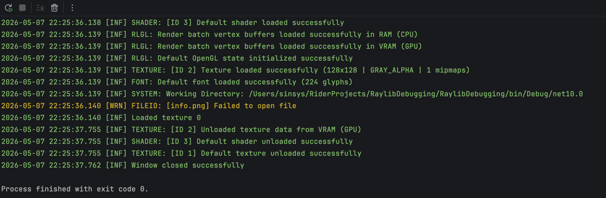

Debugging is one of those things you often forget about until something goes wrong.

A few common scenarios:

- You are developing a feature and have no clue why it is slow.
- You release the game and hear the famous sentence: `But it works on my machine!` Except... it does not work on one of your players' machines.
- You are prototyping and something behaves strangely. If only you had some visual feedback.

Do you recognize this? Then welcome to the club :D

Debugging is not only about finding broken code. Sometimes your assets are missing, your player has a different setup, your AI is doing something invisible, or your game suddenly turns into a PowerPoint.

In this tutorial, I will show a few practical ways to make debugging easier in Raylib-cs.

What are we going to cover?

- How to set up logging.
- Gizmos: a simple way to visualize debug information.
- How to profile timing and allocations without special tools.

## Prerequisites

You should have a basic understanding of C# and Raylib-cs.

Do you not? Then I made a tutorial for you! Check it here: [Getting started](gettingstarted.md)

You should start with the following code:

```csharp
using Raylib_cs;

namespace HelloWorld;

internal static class Program
{
    // STAThread is required if you deploy using NativeAOT on Windows.
    // See: https://github.com/raylib-cs/raylib-cs/issues/301
    [System.STAThread]
    public static void Main()
    {
        Raylib.InitWindow(800, 480, "Hello World");

        while (!Raylib.WindowShouldClose())
        {
            Raylib.BeginDrawing();
            Raylib.ClearBackground(Color.White);

            Raylib.DrawText("Hello, world!", 12, 12, 20, Color.Black);

            Raylib.EndDrawing();
        }

        Raylib.CloseWindow();
    }
}
```

## First up: logging

What is logging?

Logging is a way to record information about what your program is doing while it runs. You can use it to track program flow, debug issues, and monitor what happens on someone else's machine.

Raylib already has its own built-in logging system. In C#, you can also use logging libraries like Serilog, NLog, or ZLogger.

In this tutorial, I will use **ZLogger** from Cysharp. The nice thing is that it integrates with the default Microsoft logging abstractions, so you are not completely locked into one logger forever.

## Ok fine... but why is logging important?

- It helps you track what the program is doing.
- It helps you debug issues.
- It helps you understand what happened before a crash or weird bug.
- If you release your game and a player reports a problem, you can ask for the log file. Then you can inspect what happened instead of guessing.

A good log file can turn `It doesn't work` into `Ah, the texture was missing on startup`.

That is a big difference.

## Raylib-cs and the console

When you create a console project, install Raylib-cs, and run the project, you will see output like this in the console:

```bash
INFO: Initializing raylib 5.5
INFO: Platform backend: DESKTOP (GLFW)
INFO: Supported raylib modules:
INFO:     > rcore:..... loaded (mandatory)
INFO:     > rlgl:...... loaded (mandatory)
INFO:     > rshapes:... loaded (optional)
INFO:     > rtextures:. loaded (optional)
INFO:     > rtext:..... loaded (optional)
INFO:     > rmodels:... loaded (optional)
INFO:     > raudio:.... loaded (optional)
INFO: DISPLAY: Device initialized successfully
INFO:     > Display size: 2056 x 1329
INFO:     > Screen size:  800 x 480
INFO:     > Render size:  800 x 480
INFO:     > Viewport offsets: 0, 0
INFO: GLAD: OpenGL extensions loaded successfully
INFO: GL: Supported extensions count: 43
INFO: GL: OpenGL device information:
INFO:     > Vendor:   Apple
INFO:     > Renderer: Apple M4 Max
INFO:     > Version:  4.1 Metal - 89.4
INFO:     > GLSL:     4.10
INFO: GL: VAO extension detected, VAO functions loaded successfully
INFO: GL: NPOT textures extension detected, full NPOT textures supported
INFO: GL: DXT compressed textures supported
INFO: PLATFORM: DESKTOP (GLFW - Cocoa): Initialized successfully
INFO: TEXTURE: [ID 1] Texture loaded successfully (1x1 | R8G8B8A8 | 1 mipmaps)
INFO: TEXTURE: [ID 1] Default texture loaded successfully
INFO: SHADER: [ID 1] Vertex shader compiled successfully
INFO: SHADER: [ID 2] Fragment shader compiled successfully
INFO: SHADER: [ID 3] Program shader loaded successfully
INFO: SHADER: [ID 3] Default shader loaded successfully
INFO: RLGL: Render batch vertex buffers loaded successfully in RAM (CPU)
INFO: RLGL: Render batch vertex buffers loaded successfully in VRAM (GPU)
INFO: RLGL: Default OpenGL state initialized successfully
INFO: TEXTURE: [ID 2] Texture loaded successfully (128x128 | GRAY_ALPHA | 1 mipmaps)
INFO: FONT: Default font loaded successfully (224 glyphs)
INFO: SYSTEM: Working Directory: /Users/xxx/RiderProjects/RaylibDebugging/RaylibDebugging/bin/Debug/net10.0
INFO: TEXTURE: [ID 2] Unloaded texture data from VRAM (GPU)
INFO: SHADER: [ID 3] Default shader unloaded successfully
INFO: TEXTURE: [ID 1] Default texture unloaded successfully
INFO: Window closed successfully

Process finished with exit code 0.
```

This output is your friend.

You can see what Raylib is doing, which platform backend is used, what OpenGL device is detected, what textures and shaders are loaded, and what the working directory is.

That last one is especially useful when your assets do not load.

## Controlling Raylib's log level

You can control how much Raylib logs with:

```csharp
Raylib.SetTraceLogLevel(TraceLogLevel.Trace);
```

Raylib-cs exposes the following log levels:

```csharp
public enum TraceLogLevel
{
    /// <summary>
    /// Display all logs
    /// </summary>
    All = 0,

    /// <summary>
    /// Trace logging, intended for internal use only
    /// </summary>
    Trace,

    /// <summary>
    /// Debug logging, used for internal debugging, it should be disabled on release builds
    /// </summary>
    Debug,

    /// <summary>
    /// Info logging, used for program execution info
    /// </summary>
    Info,

    /// <summary>
    /// Warning logging, used on recoverable failures
    /// </summary>
    Warning,

    /// <summary>
    /// Error logging, used on unrecoverable failures
    /// </summary>
    Error,

    /// <summary>
    /// Fatal logging, used to abort program: exit(EXIT_FAILURE)
    /// </summary>
    Fatal,

    /// <summary>
    /// Disable logging
    /// </summary>
    None
}
```

## What if we want Raylib logs in a file?

The console is useful, but sometimes you also want logs in a file.

For example:

- You want to inspect logs after closing the game.
- You want a player to send you the log file.
- You want colored logs in the console, but plain logs in a file.

In C#, we can use `Microsoft.Extensions.Logging.Abstractions` for this. More info can be found on the [NuGet page](https://www.nuget.org/packages/microsoft.extensions.logging.abstractions/).

But now comes the question:

How do we connect Raylib logs to the C# logging system?

Raylib-cs has an example for custom logging here: [Customlogging.cs](https://github.com/raylib-cs/raylib-cs/blob/main/Examples/Core/Customlogging.cs)

The only downside is that this requires a little bit of unsafe code. Nothing to panic about, but be careful.

## Allow unsafe code

Because we need unsafe code, we have to allow it in the project file.

Open your `.csproj` file and add:

```xml
<AllowUnsafeBlocks>true</AllowUnsafeBlocks>
```

Here is an example project file:

```xml
<Project Sdk="Microsoft.NET.Sdk">

  <PropertyGroup>
    <OutputType>Exe</OutputType>
    <TargetFramework>net10.0</TargetFramework>
    <ImplicitUsings>enable</ImplicitUsings>
    <Nullable>enable</Nullable>
    <!-- Add this line: -->
    <AllowUnsafeBlocks>true</AllowUnsafeBlocks>
  </PropertyGroup>

  <ItemGroup>
    <PackageReference Include="Raylib-cs" Version="7.0.2" />
  </ItemGroup>

</Project>
```

## Creating a custom Raylib log callback

Now we can create a function that Raylib can call whenever it wants to log something.

Add this to `Program.cs`:

```csharp
[UnmanagedCallersOnly(CallConvs = new[] { typeof(System.Runtime.CompilerServices.CallConvCdecl) })]
private static unsafe void LogCustom(int logLevel, sbyte* text, sbyte* args)
{
    var message = Logging.GetLogMessage(new IntPtr(text), new IntPtr(args));

    Console.WriteLine("Custom " + message);
}
```

Then configure Raylib to use this custom logging function **before** `Raylib.InitWindow(...)`.

If you do it after `InitWindow`, you will miss a lot of startup logs.

```csharp
unsafe
{
    Raylib.SetTraceLogCallback(&LogCustom);
}
```

## Amazing! But this is a lot of setup just to write to the console...

Yes.

But now we control **how** Raylib logs are handled.

That is the point.

Next, we are going to plug this into an actual logger. In this tutorial, I am using **ZLogger** from Cysharp.

Install it with:

```bash
dotnet add package ZLogger
```

This will also install the default Microsoft logging framework:

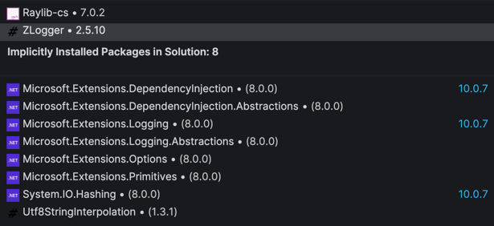

Nice bonus: if you do not like ZLogger, you can still use the Microsoft logging abstractions with something else, like Serilog or NLog.

## Setting up the logger

First, make sure you have these usings:

```csharp
using Microsoft.Extensions.Logging;
using Raylib_cs;
using ZLogger;
using ZLogger.Providers;
```

Add a private static field to the `Program` class:

```csharp
private static ILogger _logger;
```

Now change the custom log callback so it sends Raylib logs into the C# logger:

```csharp
private static unsafe void LogCustom(int logLevel, sbyte* text, sbyte* args)
{
    var message = Logging.GetLogMessage(new IntPtr(text), new IntPtr(args));

    var convertedLogLevel = (TraceLogLevel)logLevel switch
    {
        TraceLogLevel.All => LogLevel.Trace,
        TraceLogLevel.Trace => LogLevel.Trace,
        TraceLogLevel.Debug => LogLevel.Debug,
        TraceLogLevel.Info => LogLevel.Information,
        TraceLogLevel.Warning => LogLevel.Warning,
        TraceLogLevel.Error => LogLevel.Error,
        TraceLogLevel.Fatal => LogLevel.Critical,
        TraceLogLevel.None => LogLevel.None,
        _ => throw new ArgumentOutOfRangeException(nameof(logLevel), logLevel, null)
    };

    _logger.Log(convertedLogLevel, message);
}
```

Here we convert the Raylib log level to a Microsoft log level, then log the message.

## Creating the logger factory

Ok, bear with me. We need to do a few things before we can run the program.

Now it is time to create a logger factory. We are only scratching the surface of what you can do with this, but let's keep it simple.

We are going to add two things:

- A file logger.
- A console logger **with colors**.

Are you ready? This is a chunk of code. Do not worry, I added comments.

```csharp
using var factory = LoggerFactory.Create(logging =>
{
    // Set the minimum log level.
    logging.SetMinimumLevel(LogLevel.Trace);

    // Add the file logger with a rolling interval of 1 day.
    logging.AddZLoggerRollingFile(options =>
    {
        // Format the log message.
        options.UsePlainTextFormatter(formatter =>
        {
            formatter.SetPrefixFormatter(
                $"{0:utc-longdate} [{1:long}] ",
                (in template, in info) => template.Format(info.Timestamp, info.LogLevel));
        });

        // Where to write the log file.
        options.FilePathSelector = (timestamp, sequenceNumber) =>
            $"logs/{timestamp.ToLocalTime():yyyy-MM-dd}_{sequenceNumber:000}.log";

        // How often to roll the log file.
        options.RollingInterval = RollingInterval.Day;

        // How many KB to keep before rolling.
        options.RollingSizeKB = 1024;
    });

    // Add the logger to the console.
    logging.AddZLoggerConsole(options =>
    {
        options.UsePlainTextFormatter(formatter =>
        {
            // Format the log message with color codes.
            formatter.SetPrefixFormatter(
                $"{0}{1:local-longdate} [{2:short}] ",
                (in template, in info) =>
                {
                    var color = info.LogLevel switch
                    {
                        LogLevel.Trace => "\x1b[90m",       // gray
                        LogLevel.Debug => "\x1b[36m",       // cyan
                        LogLevel.Information => "\x1b[32m", // green
                        LogLevel.Warning => "\x1b[33m",     // yellow
                        LogLevel.Error => "\x1b[31m",       // red
                        LogLevel.Critical => "\x1b[35m",    // magenta
                        _ => "\x1b[0m"
                    };

                    template.Format(color, info.Timestamp, info.LogLevel);
                });

            formatter.SetSuffixFormatter(
                $"{0}",
                (in template, in info) => template.Format("\x1b[0m"));
        });
    });
});
```

Phew! The factory is ready.

Now we can create a logger:

```csharp
_logger = factory.CreateLogger("Program");
```

I also recommend setting the Raylib log level to `All`.

Why? Because we are now using the C# logger to filter the logs.

```csharp
Raylib.SetTraceLogLevel(TraceLogLevel.All);
```

Now run the program.

You should see something like this in the console:

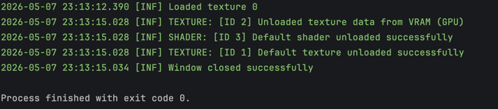

In the `bin` folder you should see a new folder called `logs`:

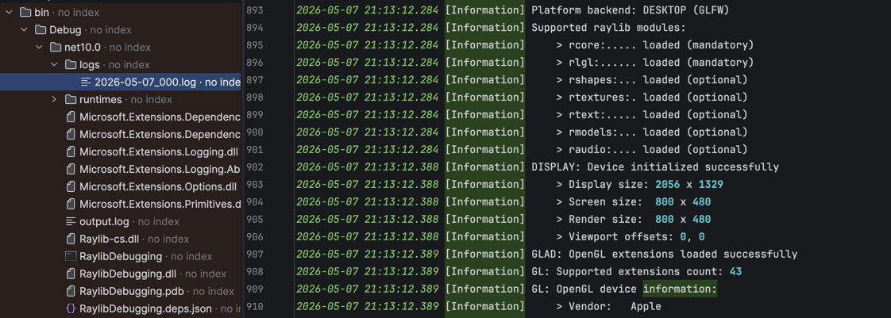

## Whoop! Now we can log! But can we see an issue?

For example, if we load a texture that does not exist:

```csharp
Texture2D texture = Texture2D.Load("idontexist.png");
```

Then we should see this in the console and in the log file:

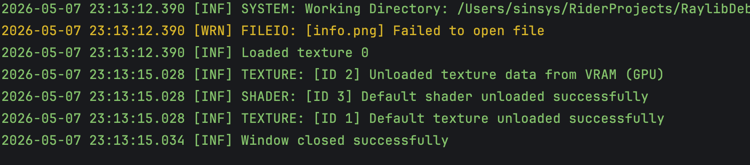

Hey! It is yellow!

That makes it a lot harder to miss.

That is it for the logging part. Next part!

# Gizmos: visualize things

Gizmos are a way to visualize information while your game is running.

They are useful when something is technically working, but hard to understand by only reading code.

For example:

- Where is this collision box?
- What path is the AI following?
- What entity is selected?
- What is the detection radius?
- What direction is this object moving?

Before we implement the most basic version, let me show you a useful real-world example.

## My Pac-Man-inspired CyberMaze game and ghost AI behavior

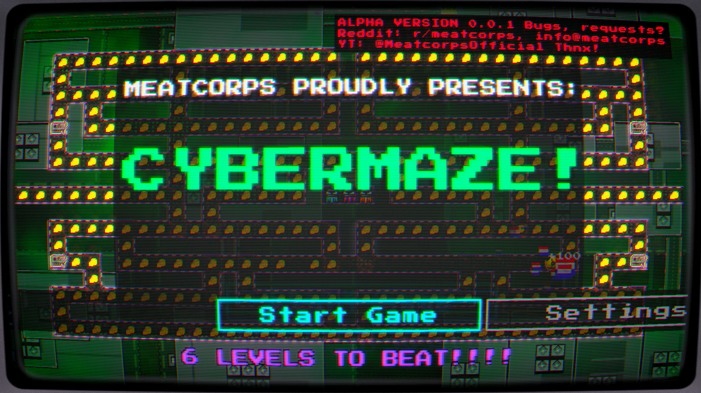

I was working on this game where ghosts walk around a maze. Sometimes they walk toward the player, and sometimes they walk away from the player.

So I implemented a form of pathfinding.

Here is the level:

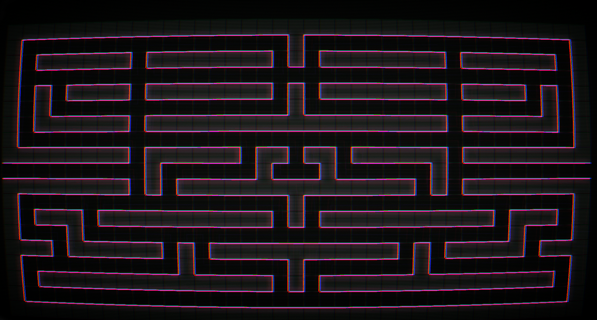

But how can we tell if the pathfinding is working correctly?

You guessed it. We can use gizmos.

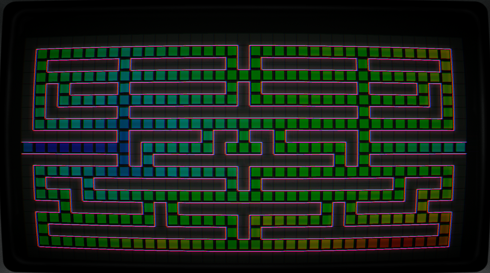

In this example, I created a heatmap.

Green is the starting point. Blue/red is the end point and cost. I am not going to explain how the pathfinding works here, but this is a good example of why visual debugging is useful.

It makes invisible logic visible.

## So, how do we visualize things?

In the most basic form, we can create a queue of draw actions.

This is useful because you can add gizmos outside the draw loop and then draw them later inside the draw loop.

Add this above `while (!Raylib.WindowShouldClose())`:

```csharp
var gizmos = new Queue<Action>();
```

Now you can enqueue a gizmo from anywhere in your update logic:

```csharp
gizmos.Enqueue(() => Raylib.DrawText("Info 1", 50, 50, 20, Color.Red));
```

Then, inside the draw loop, draw all queued gizmos:

```csharp
while (gizmos.TryDequeue(out var gizmo))
    gizmo();
```

You should see this in the game:

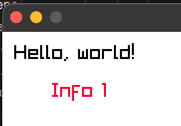

I know this does not look like much, but you get the idea.

A few tips if you want to expand this:

- Make a static debug draw class with common actions like lines, rectangles, circles, text, and vectors.
- Keep it quick and simple. This is debug tooling, not your gameplay architecture.
- Do not use dependency injection for every little debug line. You want this to be easy to call while investigating a problem.
- Use `Raylib.DrawFPS()` when you just want a quick FPS counter.
- Use ImGui for more advanced debug windows. I will dedicate a tutorial to that later.

One warning: this `Queue<Action>` version is great for quick debugging, but it allocates delegates and closures when used heavily.

Do not spam thousands of closure-based gizmos every frame in production code. Later, you can replace this with structs, pooled commands, or a proper debug draw service.

For now, this version is simple and easy to understand.

# Profiling: why is my game SO slow?

You are happily developing your game. You add features. You look at the screen and think:

Am I playing my game or watching a PowerPoint?

Then it is time to measure.

I recommend profiling new features early. It can save you a lot of pain later.

For simple profiling, two things are very useful:

- Timing
- Allocations

Timing tells you how long something takes.

Allocations tell you if you are creating memory pressure. This is important in C#, because the Garbage Collector is not always your friend.

## How to profile allocations

The Garbage Collector is not always your friend, but it does give us some tools.

At the place where you want to start measuring allocations, add this:

```csharp
var alloc = GC.GetAllocatedBytesForCurrentThread();
```

This stores the current allocation count for the current thread.

When you want to stop measuring, add this:

```csharp
var totalAlloc = GC.GetAllocatedBytesForCurrentThread() - alloc;
```

`totalAlloc` is in bytes.

Now you can write it to the console or abuse the window title. The window title is a great place for quick-and-dirty debug output :P

```csharp
Raylib.SetWindowTitle($"Alloc: {totalAlloc} bytes");
// or
Console.WriteLine($"Alloc: {totalAlloc} bytes");
```

That is it.

Of course, you can make this much fancier, but now you have the basic idea.

## How to profile time

In C#, there is a class called `Stopwatch` in the `System.Diagnostics` namespace.

You can use a `Stopwatch` instance, but for very small measurements I like using `Stopwatch.GetTimestamp()` directly.

At the place where you want to start measuring, add this:

```csharp
var start = Stopwatch.GetTimestamp();
```

This gives you the current timestamp in ticks. The raw value is not very useful by itself, but we can convert it.

At the end of the code you want to measure, do this:

```csharp
var totalUs = (Stopwatch.GetTimestamp() - start) * 1_000_000 / Stopwatch.Frequency;
```

Now you have the elapsed time in microseconds.

Keep in mind that micro-benchmarks can be noisy, so measure more than once before drawing conclusions.

Let's abuse the window title again and show both timing and allocations:

```csharp
Raylib.SetWindowTitle($"Total time: {totalUs}us | Alloc: {totalAlloc} bytes");
```

You should see this in the window title:

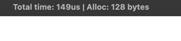

There you go. Now you can do some basic profiling.

Here is an example of what this can become later:

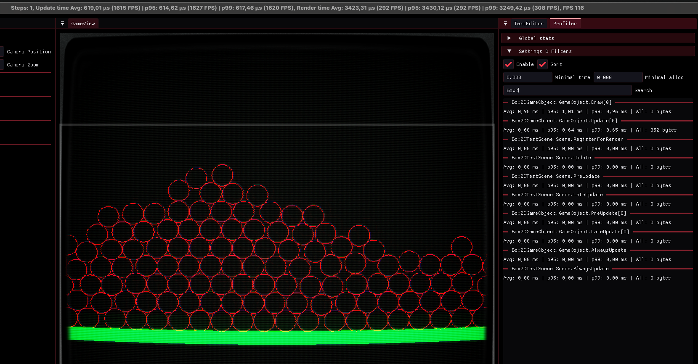

# Full code example

```csharp
using System.Diagnostics;
using System.Runtime.InteropServices;
using Microsoft.Extensions.Logging;
using Raylib_cs;
using ZLogger;
using ZLogger.Providers;

namespace HelloWorld;

internal static class Program
{
    private static ILogger _logger;

    [UnmanagedCallersOnly(CallConvs = new[] { typeof(System.Runtime.CompilerServices.CallConvCdecl) })]
    private static unsafe void LogCustom(int logLevel, sbyte* text, sbyte* args)
    {
        var message = Logging.GetLogMessage(new IntPtr(text), new IntPtr(args));

        var convertedLogLevel = (TraceLogLevel)logLevel switch
        {
            TraceLogLevel.All => LogLevel.Trace,
            TraceLogLevel.Trace => LogLevel.Trace,
            TraceLogLevel.Debug => LogLevel.Debug,
            TraceLogLevel.Info => LogLevel.Information,
            TraceLogLevel.Warning => LogLevel.Warning,
            TraceLogLevel.Error => LogLevel.Error,
            TraceLogLevel.Fatal => LogLevel.Critical,
            TraceLogLevel.None => LogLevel.None,
            _ => throw new ArgumentOutOfRangeException(nameof(logLevel), logLevel, null)
        };

        _logger.Log(convertedLogLevel, message);
    }

    [System.STAThread]
    public static void Main()
    {
        using var factory = LoggerFactory.Create(logging =>
        {
            // Set the minimum log level.
            logging.SetMinimumLevel(LogLevel.Trace);

            // Add the file logger with a rolling interval of 1 day.
            logging.AddZLoggerRollingFile(options =>
            {
                // Format the log message.
                options.UsePlainTextFormatter(formatter =>
                {
                    formatter.SetPrefixFormatter(
                        $"{0:utc-longdate} [{1:long}] ",
                        (in template, in info) => template.Format(info.Timestamp, info.LogLevel));
                });

                // Where to write the log file.
                options.FilePathSelector = (timestamp, sequenceNumber) =>
                    $"logs/{timestamp.ToLocalTime():yyyy-MM-dd}_{sequenceNumber:000}.log";

                // How often to roll the log file.
                options.RollingInterval = RollingInterval.Day;

                // How many KB to keep before rolling.
                options.RollingSizeKB = 1024;
            });

            // Add the logger to the console.
            logging.AddZLoggerConsole(options =>
            {
                options.UsePlainTextFormatter(formatter =>
                {
                    // Format the log message with color codes.
                    formatter.SetPrefixFormatter(
                        $"{0}{1:local-longdate} [{2:short}] ",
                        (in template, in info) =>
                        {
                            var color = info.LogLevel switch
                            {
                                LogLevel.Trace => "\x1b[90m",       // gray
                                LogLevel.Debug => "\x1b[36m",       // cyan
                                LogLevel.Information => "\x1b[32m", // green
                                LogLevel.Warning => "\x1b[33m",     // yellow
                                LogLevel.Error => "\x1b[31m",       // red
                                LogLevel.Critical => "\x1b[35m",    // magenta
                                _ => "\x1b[0m"
                            };

                            template.Format(color, info.Timestamp, info.LogLevel);
                        });

                    formatter.SetSuffixFormatter(
                        $"{0}",
                        (in template, in info) => template.Format("\x1b[0m"));
                });
            });
        });

        _logger = factory.CreateLogger("Program");
        _logger.LogInformation("Game started");

        Raylib.SetTraceLogLevel(TraceLogLevel.All);

        unsafe
        {
            Raylib.SetTraceLogCallback(&LogCustom);
        }

        Raylib.InitWindow(800, 480, "Hello World");

        var texture = Raylib.LoadTexture("info.png");
        _logger.LogInformation("Loaded texture {texture}", texture.Id);

        var gizmos = new Queue<Action>();

        while (!Raylib.WindowShouldClose())
        {
            var start = Stopwatch.GetTimestamp();
            var alloc = GC.GetAllocatedBytesForCurrentThread();

            gizmos.Enqueue(() => Raylib.DrawText("Info 1", 50, 50, 20, Color.Red));

            Raylib.BeginDrawing();
            Raylib.ClearBackground(Color.White);
            Raylib.DrawText("Hello, world!", 12, 12, 20, Color.Black);

            while (gizmos.TryDequeue(out var gizmo))
                gizmo();

            // This is intentionally here to create allocations,
            // so you can see the allocation counter change.
            var test = $"{gizmos.Count} gizmos whatever";
            test += "ALLOC";

            Raylib.EndDrawing();

            var totalAlloc = GC.GetAllocatedBytesForCurrentThread() - alloc;
            var totalUs = (Stopwatch.GetTimestamp() - start) * 1_000_000 / Stopwatch.Frequency;

            Raylib.SetWindowTitle($"Total time: {totalUs}us | Alloc: {totalAlloc} bytes");
        }

        Raylib.UnloadTexture(texture);
        Raylib.CloseWindow();

        unsafe
        {
            Raylib.SetTraceLogCallback(&Logging.LogConsole);
        }
    }
}
```

# TL;DR

- Logging helps you understand what happened, especially after release.
- Raylib logs can be redirected into a C# logger.
- Gizmos help you visualize invisible game logic.
- `GC.GetAllocatedBytesForCurrentThread()` can show allocations.
- `Stopwatch.GetTimestamp()` can measure small pieces of code.
- Quick profiling is better than guessing.

Alright, that is it for today.

I hope you enjoyed this tutorial. If you have questions or suggestions, please let me know!
