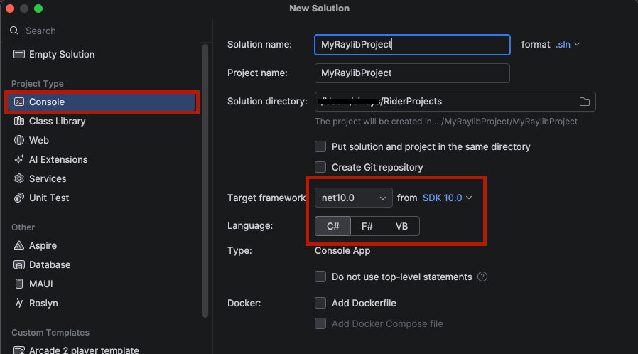
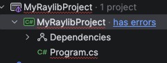
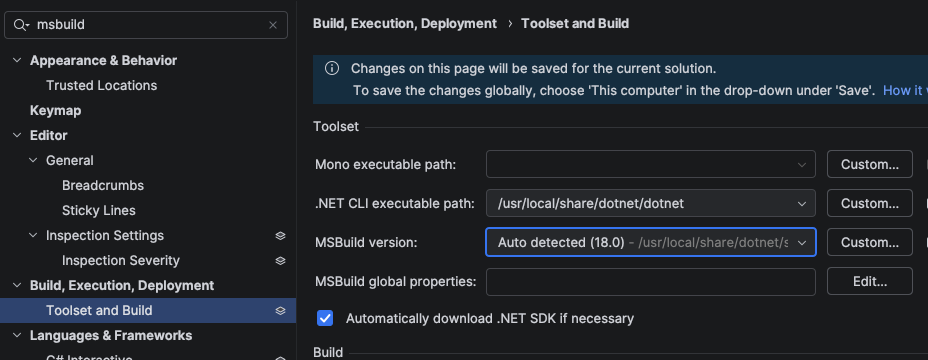
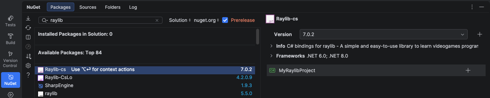
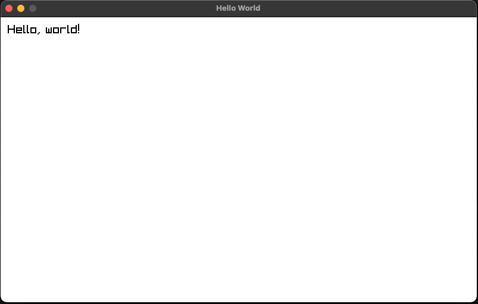
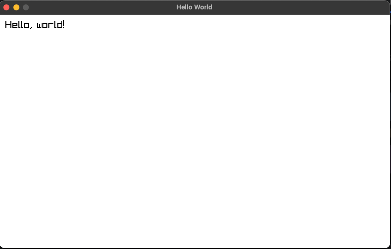
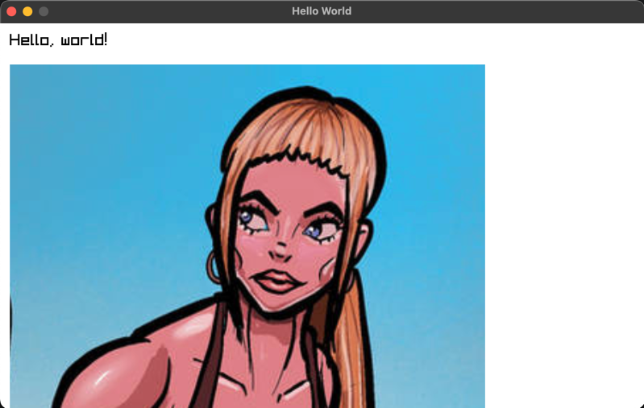
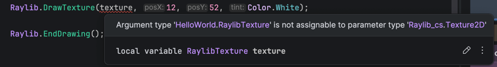

# Getting Started: Hello World

So you are interested in creating a game or fun tools with Raylib, but you do not know where to start?

Here you can find the basic information to get your first Raylib-cs project running.

What can you expect?

- Creating a Raylib window
- Drawing text
- Loading a texture
- Setting up asset loading in your C# project
- A small C# quality-of-life wrapper for Raylib resources

Alright, let’s get started!

## Prerequisites

1. Install the .NET SDK 10.  
   [Get it here!](https://dotnet.microsoft.com/en-us/download/dotnet/10.0)

2. Get yourself a C# IDE. My recommendations:

    - [Rider](https://www.jetbrains.com/rider/)  
      *Downside: it is not free, but it is a really nice cross-platform IDE.*

    - [Visual Studio](https://visualstudio.microsoft.com/vs/)  
      *Downside: Windows only.*

    - [Visual Studio Code](https://code.visualstudio.com/)  
      Also install the following extension:
        - [C# Dev Kit](https://learn.microsoft.com/en-us/visualstudio/subscriptions/vs-c-sharp-dev-kit)

3. Good mood :D  
   Grab something to drink and enjoy!

### Why use version 10 LTS version of .NET and not the latest version?

My recommendation is to use the LTS version of .NET for long-term projects. The LTS version is more stable and has longer support.

Feel free to use newer versions of .NET if you want, but for this documentation I am using .NET 10.

## Create a new project

You can create the project from the command line or from your IDE. I will show both.

## Create a new project using the command prompt

1. Open the command prompt and navigate to the directory where you want to create your project.

2. Create a new console project:

```bash
dotnet new console -n MyRaylibProject
```

This will create a new console application project named `MyRaylibProject` in the current directory.

3. Go into the project folder:

```bash
cd MyRaylibProject
```

4. Install the Raylib-cs NuGet package:

```bash
dotnet add package Raylib-cs
```

For more information about the Raylib-cs NuGet package, go to the [Raylib-cs repository](https://github.com/raylib-cs/raylib-cs).

5. Open the project in your IDE.

## Create a new project using JetBrains Rider

1. Open Rider and click `File` -> `New Solution`.

2. Use the following settings:



3. Click `Create`.

4. You should now see the default Hello World project:

```csharp
// See https://aka.ms/new-console-template for more information

Console.WriteLine("Hello, World!");
```

### Do you see an error?



Go to settings with `Ctrl+Alt+S` and open the MSBuild settings:



Make sure the .NET CLI executable path and MSBuild path are set correctly.

All good? Let’s continue!

5. Go to the NuGet package manager and install the Raylib-cs package:



Your project should now be ready to go!

## First Hello World

Replace all the code in `Program.cs` with the following code.

No worries, I will explain what this code does after we run it.

```csharp
using Raylib_cs;

namespace MyRaylibProject;

internal static class Program
{
    // STAThread is required if you deploy using NativeAOT on Windows.
    // See: https://github.com/raylib-cs/raylib-cs/issues/301
    [System.STAThread]
    public static void Main()
    {
        Raylib.InitWindow(800, 480, "Hello World");

        while (!Raylib.WindowShouldClose())
        {
            Raylib.BeginDrawing();
            Raylib.ClearBackground(Color.White);

            Raylib.DrawText("Hello, world!", 12, 12, 20, Color.Black);

            Raylib.EndDrawing();
        }

        Raylib.CloseWindow();
    }
}
```

Build and run the project. You should see the following:



**Congratulations! You just created your first Raylib application! Now ship it! Release it on Steam and let the world know!**

No?

Ah, right. You want to know more?

Alright, let me explain what this code does first.

## What does this code do?

```csharp
public static void Main()
```

This is the entry point of the application. It is the first method that is called when the application starts.

```csharp
Raylib.InitWindow(800, 480, "Hello World");
```

This initializes a window with a width of 800 pixels, a height of 480 pixels, and the title `Hello World`.

This is also where Raylib initializes the window and graphics context.

```csharp
while (!Raylib.WindowShouldClose())
```

This is the main loop of the application.

By default, pressing `ESC` closes the window. This can be changed, but that is a topic for later.

```csharp
Raylib.BeginDrawing();
```

This starts drawing to the window.

Every drawing operation should happen between `BeginDrawing()` and `EndDrawing()`.

My advice is to do your update logic before drawing.

```csharp
Raylib.ClearBackground(Color.White);
```

This clears the background of the window with a white color.

Very bright white... yes, I like dark mode.

Also interesting note: official Raylib uses uppercase names for colors, like `WHITE` and `BLACK`. In Raylib-cs, colors use C# naming style, so you use `Color.White` and `Color.Black`.

```csharp
Raylib.DrawText("Hello, world!", 12, 12, 20, Color.Black);
```

This draws the text `Hello, world!` at position `(12, 12)` with a font size of 20 pixels and a black color.

This uses the default Raylib font.

```csharp
Raylib.EndDrawing();
```

This ends the drawing step and presents the frame.

```csharp
Raylib.CloseWindow();
```

This closes the window and frees internal Raylib resources.

We are not talking about textures, sounds, and other manually loaded resources here. Keep that in mind!

## Ok, I want some pictures!

Alright, let’s load an image.

1. Create a folder inside your project called `Assets`.

2. Put an image inside that folder. You can use this one as an example:


3. Below this line:

```csharp
Raylib.InitWindow(800, 480, "Hello World");
```

Add this line:

```csharp
var texture = Raylib.LoadTexture("Assets/image.png");
```

4. Below this line:

```csharp
Raylib.DrawText("Hello, world!", 12, 12, 20, Color.Black);
```

Add this line:

```csharp
Raylib.DrawTexture(texture, 12, 52, Color.White);
```

5. Above this line:

```csharp
Raylib.CloseWindow();
```

Add this line:

```csharp
Raylib.UnloadTexture(texture);
```

Your code should now load the texture, draw it, and unload it before the window closes.

Build and run the project. You should now see this:



Whut?! Where is the image?!?

This is exactly what I wanted to show you, and this is why we created a console application.

Let’s take a look at the console output:

```bash
WARNING: FILEIO: [Assets/image.png] Failed to open file
INFO: TEXTURE: [ID 2] Unloaded texture data from VRAM (GPU)
INFO: SHADER: [ID 3] Default shader unloaded successfully
INFO: TEXTURE: [ID 1] Default texture unloaded successfully
INFO: Window closed successfully
```

There are no C# errors. The application did not crash. But the image was not loaded.

You can see this warning in the console:

```bash
WARNING: FILEIO: [Assets/image.png] Failed to open file
```

The reason is that the image was not copied to the `bin` output directory.

Let’s fix that now.

## Copy assets to the output directory

Open your `.csproj` file as text in your IDE and add the following lines:

```xml
<ItemGroup>
  <Compile Remove="Assets/**/*"/>
</ItemGroup>

<ItemGroup>
  <Content Include="Assets/**/*.*">
    <CopyToOutputDirectory>PreserveNewest</CopyToOutputDirectory>
  </Content>
</ItemGroup>
```

What does this do?

- It copies all files from the `Assets` folder to the output directory.
- It only copies files that changed.
- You do not need to manually track every asset file :D

Build and run the project again. You should now see this:



WAY better! Now we can see the image.

## Bonus tip: a C# way to handle Raylib resources

You have now seen this:

```csharp
var texture = Raylib.LoadTexture("Assets/image.png");
```

And this:

```csharp
Raylib.UnloadTexture(texture);
```

That works fine, but we can make this a bit nicer in C#.

We can use the `using` statement to automatically unload the texture when it goes out of scope. This is a common C# pattern for resources that need to be cleaned up.

How? Let me show you.

At the end of the file, add this:

```csharp
public readonly struct RaylibTexture : IDisposable
{
    public readonly Texture2D Texture;

    public RaylibTexture(string path)
    {
        Texture = Raylib.LoadTexture(path);
    }

    public void Dispose()
    {
        Raylib.UnloadTexture(Texture);
    }
}
```

This struct implements `IDisposable`, which means C# can call `Dispose()` automatically when used with `using`.

Now replace this:

```csharp
var texture = Raylib.LoadTexture("Assets/image.png");
```

With this:

```csharp
using var texture = new RaylibTexture("Assets/image.png");
```

And remove this line:

```csharp
Raylib.UnloadTexture(texture);
```

Build the project.

You will now get an error:



This happens because `Raylib.DrawTexture(...)` expects a `Texture2D`, but we are now passing it our own `RaylibTexture` type.

We have two options.

Option 1: Use `texture.Texture` everywhere.

```csharp
Raylib.DrawTexture(texture.Texture, 12, 52, Color.White);
```

This works, but it is a bit ugly if you need to do it everywhere.

Option 2: Use an implicit conversion.

This lets us tell the compiler how to automatically convert `RaylibTexture` to `Texture2D`.

Add this inside the `RaylibTexture` struct:

```csharp
public static implicit operator Texture2D(RaylibTexture texture)
{
    return texture.Texture;
}
```

The full struct now looks like this:

```csharp
public readonly struct RaylibTexture : IDisposable
{
    public readonly Texture2D Texture;

    public RaylibTexture(string path)
    {
        Texture = Raylib.LoadTexture(path);
    }

    public static implicit operator Texture2D(RaylibTexture texture)
    {
        return texture.Texture;
    }

    public void Dispose()
    {
        Raylib.UnloadTexture(Texture);
    }
}
```

Build and run the project again.

You should still see the image, but now the texture is automatically unloaded when the application leaves the scope.

Nice, right?

## Final code

Your `Program.cs` should now look like this:

```csharp
using Raylib_cs;

namespace MyRaylibProject;

internal static class Program
{
    // STAThread is required if you deploy using NativeAOT on Windows.
    // See: https://github.com/raylib-cs/raylib-cs/issues/301
    [System.STAThread]
    public static void Main()
    {
        Raylib.InitWindow(800, 480, "Hello World");

        using var texture = new RaylibTexture("Assets/image.png");

        while (!Raylib.WindowShouldClose())
        {
            Raylib.BeginDrawing();
            Raylib.ClearBackground(Color.White);

            Raylib.DrawText("Hello, world!", 12, 12, 20, Color.Black);
            Raylib.DrawTexture(texture, 12, 52, Color.White);

            Raylib.EndDrawing();
        }

        Raylib.CloseWindow();
    }
}

public readonly struct RaylibTexture : IDisposable
{
    public readonly Texture2D Texture;

    public RaylibTexture(string path)
    {
        Texture = Raylib.LoadTexture(path);
    }

    public static implicit operator Texture2D(RaylibTexture texture)
    {
        return texture.Texture;
    }

    public void Dispose()
    {
        Raylib.UnloadTexture(Texture);
    }
}
```

## TL;DR

- Create a new C# console project
- Install the Raylib-cs NuGet package
- Create a Raylib window
- Draw text to the window
- Add an `Assets` folder
- Configure the `.csproj` file so assets are copied to the output directory
- Load and draw a texture
- Unload Raylib resources manually, or wrap them with `IDisposable` and `using`

Thank you for reading.

In the next chapter we will learn more about debugging and profiling.
