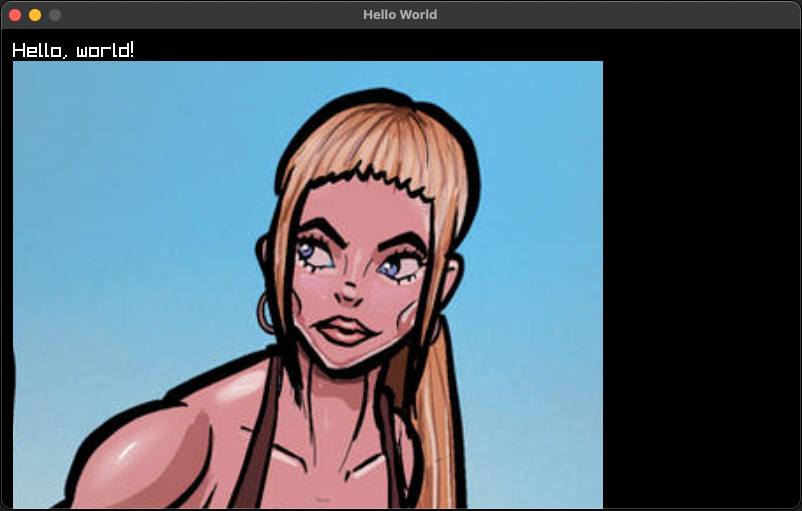
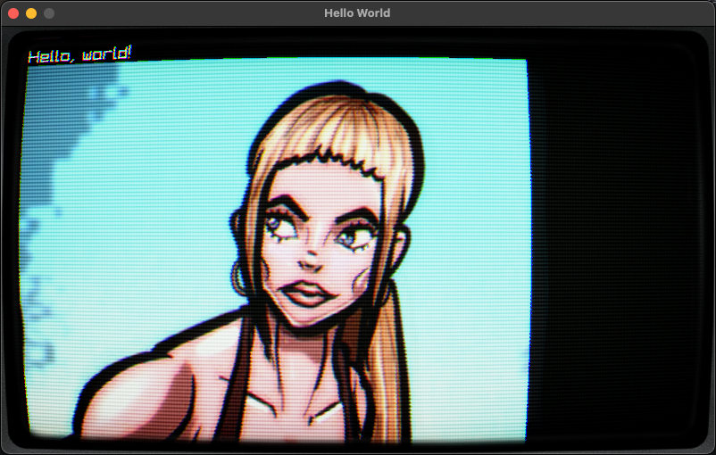
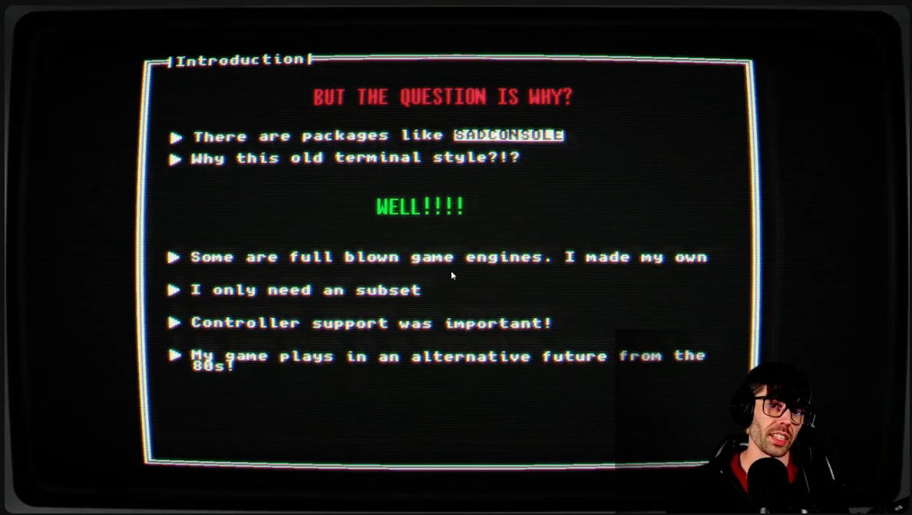
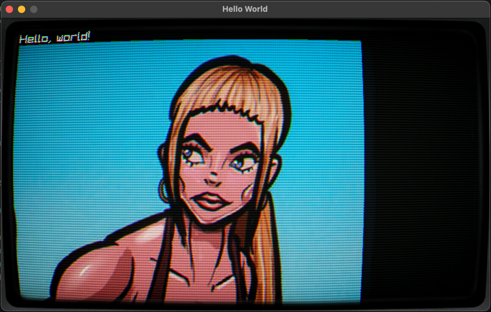
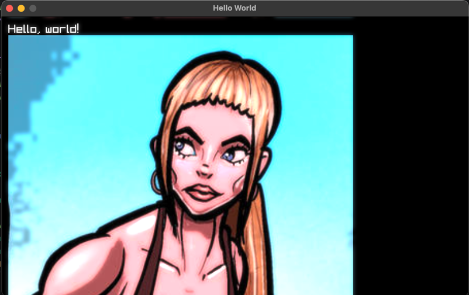
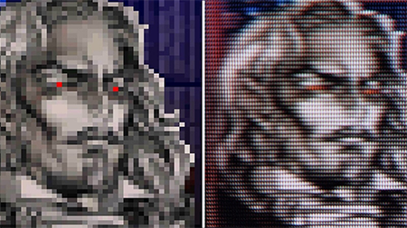
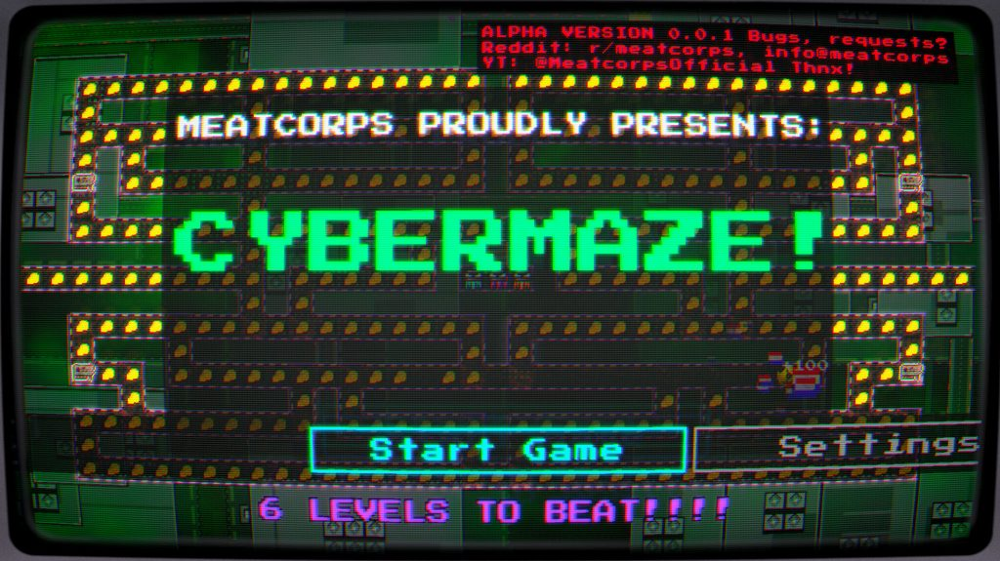

# Post-processing stack in Raylib-cs

I can explain this with a lot of words, but pictures are worth a thousand words.

Here is the example without post-processing:



Now, let's add a CRT effect on top of it:



WOW! That is a day and night difference.

In this tutorial, I will guide you through setting up a post-processing stack in Raylib-cs.

This is a more advanced topic, so I decided to include a lot of the implementation as example code. But don't worry, I will still explain how it works in the guts.

**NOTE:** I know not everyone likes abstraction and inheritance. But because some parts have repeated code, I use a little bit of both here. I keep it to the bare minimum.

## Pre-requisites

- Basic understanding of C#
- Basic understanding of raylib-cs. To get started, check out: [Getting started](gettingstarted.md)
- .NET 10
- Example code from this repository: [example code](https://github.com/meatcorps/Documentation/tree/main/examples/RaylibPostProcessing)

I recommend you clone the repository or download the zip and extract the `RaylibPostProcessing` folder.

This tutorial assumes you are comfortable with C# classes and basic Raylib-cs drawing. If you are completely new to Raylib-cs, start with the Hello World guide first.

## What is post-processing?

Post-processing is a technique that allows you to apply effects to the final image of a rendered scene.

That is the theory version.

In practice, it can be used to create visual effects such as bloom, motion blur, CRT effects, color grading, screen distortion, damage flashes, and more.

By applying these effects, you can enhance the visual quality of your game or application and create a more immersive experience for the user.

In this example, I will use my CRT effect. Feel free to use it as a starting point for your own projects. It is open source and MIT licensed.

The main trick is this:

1. You render your game content into a `RenderTexture`.
2. You apply shaders to that texture.
3. You ping-pong between render textures so each shader pass can write to a new target.
4. You render the final result to the screen buffer.

That is post-processing in a nutshell.

## Let's get started!

Like always, create a new console project. I will be using .NET 10.

Then copy the folders [Assets](https://github.com/meatcorps/Documentation/tree/main/examples/RaylibPostProcessing/Assets), [Utilities](https://github.com/meatcorps/Documentation/tree/main/examples/RaylibPostProcessing/Utilities), and [PostProcessing](https://github.com/meatcorps/Documentation/tree/main/examples/RaylibPostProcessing/PostProcessing) into your project.

Then in `Program.cs`, use the following code:

```csharp
using System.Numerics;
using PostProcessingExample.PostProcessing;
using PostProcessingExample.Utilities;
using Raylib_cs;

namespace PostProcessingExample;

internal static class Program
{
    [System.STAThread]
    public static void Main()
    {
        // Small remark. In my previous tutorials I mention the loading and unloading of textures trick.
        // I did not apply it here. Because I wanted to keep this example as barebones as possible.
        // This makes it easier to use in your own projects. You're welcome ;)
        
        Raylib.InitWindow(800, 480, "Hello World");
        
        // Post-processing renderer its main task is to ping-pong between the render textures and return the final render texture.
        using PostProcessingRenderer postProcessingRenderer = new();
        
        // Render texture where we will render everything. So, we can apply post-processing effects to it.
        var renderLayer = Raylib.LoadRenderTexture(800, 480);
        
        // Texture for the CRT effect
        var frameTexture = Raylib.LoadTexture("Assets/CRTSidePanels.png");
        
        // Example texture for testing
        var imageTexture = Raylib.LoadTexture("Assets/Image.png");
        
        // Load shaders
        var shaders = new List<BaseShader>();
        shaders.AddRange(SetupShaders.SetupProcessingBloom());
        shaders.Add(new CrtNewPixiePostProcessor()
            .SetFrameTexture(frameTexture));

        // Initialize shaders. By loading the actual shader files, this will also compile the shader.
        foreach (var shader in shaders)
            shader.Initialize();
        
        while (!Raylib.WindowShouldClose())
        {
            Raylib.BeginDrawing();
            
            // Start the render texture. Here is the actual "drawing".
            Raylib.BeginTextureMode(renderLayer);
            Raylib.ClearBackground(Color.Black);
            Raylib.DrawText("Hello, world!", 12, 12, 20, Color.White);
            Raylib.DrawTexture(imageTexture, 12, 32, Color.White);
            
            // Here we end the "drawing".
            Raylib.EndTextureMode();

            // Make the drawing result shiny :D By applying some post-processing effects!
            var finalTexture = postProcessingRenderer.Render(shaders, renderLayer);
            
            // Render the post-processing result!
            Raylib.DrawTexturePro(
                finalTexture.Texture,
                new Rectangle(0, 0, finalTexture.Texture.Width, -finalTexture.Texture.Height), 
                new Rectangle(0, 0, finalTexture.Texture.Width, finalTexture.Texture.Height), 
                Vector2.Zero,
                0,
                Color.White
            );
            
            Raylib.EndDrawing();
        }

        // Unload everything! We don't want to leak memory!
        foreach (var shader in shaders)
            shader.Dispose();
        Raylib.UnloadRenderTexture(renderLayer);
        Raylib.UnloadTexture(frameTexture);
        Raylib.UnloadTexture(imageTexture);
        Raylib.CloseWindow();
    }
}
```

I added comments to the most important parts of the code. But allow me to explain a few sections.

## Let's start with the loading

```csharp
using PostProcessingRenderer postProcessingRenderer = new();

var shaders = new List<BaseShader>();
shaders.Add(...Add your shaders here...);

var renderLayer = Raylib.LoadRenderTexture(...Set final viewport size...);

// Initialize shaders. By loading the actual shader files, this will also compile the shader.
foreach (var shader in shaders)
    shader.Initialize();
```

```csharp
using PostProcessingRenderer postProcessingRenderer = new();
```

This creates the post-processing renderer.

Sure, Captain Obvious. I can read that from the name.

But as explained before, this renderer handles the ping-pong between render textures and gives back the final render texture. It does that by receiving a list of `BaseShader` objects.

Speaking of shaders :D

```csharp
var shaders = new List<BaseShader>();
```

Here we create a list of shaders. Add your shaders to this list, as long as they implement the `BaseShader` abstract class.

Why an abstract class?

Because handling shaders has a lot of shared code. To create a proper post-processing stack, we need multiple shaders and they all do similar things:

- Load the shader
- Set values on the shader
- Render to a texture
- Unload the shader when we are done

That is why I made the `BaseShader` abstract class. Later on, I will explain how to use it.

```csharp
var renderLayer = Raylib.LoadRenderTexture(...Set final viewport size...);
```

Here we create a render texture. This is where you render the game or content.

For the correct result, I recommend setting this to your window size or the internal resolution of your game.

```csharp
foreach (var shader in shaders)
    shader.Initialize();
```

Here we initialize the shaders.

Why is this separated?

Because shader loading can only be done after Raylib is initialized. This also keeps the setup useful if you later want a dedicated loading step for resources.

## In the game render loop

First, we need to tell Raylib to render to the render texture:

```csharp
Raylib.BeginTextureMode(renderLayer);
```

Then you draw your game.

After that, you end the render texture mode:

```csharp
Raylib.EndTextureMode();
```

Now we can do the post-processing:

```csharp
var finalTexture = postProcessingRenderer.Render(shaders, renderLayer);
```

Here we get the final texture back.

Do not worry about unloading the internal render textures used by the post-processing renderer. That is handled by the renderer itself, because we created it with the **using** statement.

Now it is time to render the final texture to the screen:

```csharp
Raylib.DrawTexturePro(
    finalTexture.Texture,
    new Rectangle(0, 0, finalTexture.Texture.Width, -finalTexture.Texture.Height), 
    new Rectangle(0, 0, finalTexture.Texture.Width, finalTexture.Texture.Height), 
    Vector2.Zero,
    0,
    Color.White
);
```

Do you see the strange `-finalTexture.Texture.Height`?

That is because render textures are flipped vertically. So we need to flip it back. This is common behavior with render textures.

That is how you use the post-processing renderer.

Now, let me describe how it internally works and how you can extend it.

## BaseShader.cs

If you did not add it to your project, you can find it here: [BaseShader.cs](https://github.com/meatcorps/Documentation/blob/main/examples/RaylibPostProcessing/PostProcessing/BaseShader.cs)

The `BaseShader` class is the base class for all shaders. It contains the shared logic that every post-processing shader needs.

It has a few rules to follow:

- It initializes with the location of the shader.
- It has an `Initialize()` method that is called when the shader is loaded.
- It contains helper functions to set values on the shader.
- It has a generic `Apply` method that starts the shader, renders the input texture, and writes the result to another render texture. This is important for the ping-pong effect.
- It makes sure that the shader gets unloaded.
- It has an abstract `ApplyValues` method where you can set the values for your shader.

## That's fine, but how about an example?

Let's take a look at a simple one: the `GaussianBlurPostProcessor` class.

You can find it here: [GuassianBlurPostProcessor.cs](https://github.com/meatcorps/Documentation/blob/main/examples/RaylibPostProcessing/PostProcessing/GaussianBlurPostProcessor.cs)

```csharp
public class GaussianBlurPostProcessor : BaseShader
{
    public GaussianBlurPostProcessor()
        : base("Assets/Shaders/gaussian_blur.fx", new[] { "resolution", "direction", "spread" })
    {
    }

    public Vector2 Direction { get; set; } = new(1f, 0f); // set (0,1) for vertical
    public float Spread { get; set; } = 1.0f;

    protected override void ApplyValues(Shader shader, Texture2D target)
    {
        SetResolutionValue("resolution", target);
        SetValue("direction", Direction);
        SetValue("spread", Spread);
    }
}
```

In this part:

```csharp
base("Assets/Shaders/gaussian_blur.fx", new[] { "resolution", "direction", "spread" })
```

You can see that we specify the location of the shader and the uniforms that we need to set.

Then in the `ApplyValues` method, we set the values for the shader:

```csharp
protected override void ApplyValues(Shader shader, Texture2D target)
```

The `SetResolutionValue` method sets the `resolution` uniform to the current resolution of the target texture.

The `SetValue` method sets the value of the uniform to the specified value.

If you take a look at the shader itself:

```glsl
#version 330

in vec2 fragTexCoord;
out vec4 finalColor;

uniform sampler2D texture0;

// Size in pixels of the texture being blurred (NOT window size!)
uniform vec2 resolution;

// (1, 0) for horizontal, (0, 1) for vertical
uniform vec2 direction;

// Blur spread / radius factor.
// 1.0 = base blur, 2.0 = wider, 0.5 = sharper
uniform float spread;

// Radius of the kernel (4 → 9 taps)
const int RADIUS = 8;

void main()
{
    // One texel in the chosen direction
    vec2 texel = direction / resolution;

    // Base sigma – you can tweak this
    float baseSigma = 1.0;

    // Effective sigma scales with spread
    float sigma = baseSigma + spread * 3.0;
    float twoSigma2 = 2.0 * sigma * sigma;

    vec4 sum = vec4(0.0);
    float weightSum = 0.0;

    for (int i = -RADIUS; i <= RADIUS; i++)
    {
        float x = float(i);

        // Gaussian weight for this offset
        float w = exp(-(x * x) / twoSigma2);

        vec2 uv = fragTexCoord + x * texel;
        uv = clamp(uv, vec2(0.0), vec2(1.0));

        vec4 sampleColor = texture(texture0, uv);

        sum += sampleColor * w;
        weightSum += w;
    }

    // Normalize so total weight = 1
    sum /= weightSum;

    finalColor = sum;
}
```

You can see that we are wiring these uniforms from C#:

```glsl
uniform sampler2D texture0;

// Size in pixels of the texture being blurred (NOT window size!)
uniform vec2 resolution;

// (1, 0) for horizontal, (0, 1) for vertical
uniform vec2 direction;

// Blur spread / radius factor.
// 1.0 = base blur, 2.0 = wider, 0.5 = sharper
uniform float spread;
```

That is how it works, and hopefully this explains why I made an abstract class for shaders.

## PostProcessingRenderer.cs

If you did not add it to your project, you can find it here: [PostProcessingRenderer.cs](https://github.com/meatcorps/Documentation/blob/main/examples/RaylibPostProcessing/PostProcessing/PostProcessingRenderer.cs)

This class accepts a list of shaders and a render texture. Then it applies each shader with the ping-pong effect.

The main trick is here:

```csharp
_swapped = !_swapped;
```

Then in the `Apply` call, we swap the render textures:

```csharp
postProcessor.Apply(first ? sourceTexture.Texture : FromTexture.Texture, ToTexture);
```

## But wait! Why is there an `INeedsCurrentViewTexture` interface?

Good point!

Some post-processors need access to the original scene texture, not only the current ping-pong result. This interface gives them that original view texture when needed.

In my experience, the bloom threshold shader is the only shader in this example that needs it. But if you have another shader that requires access to the original scene texture, you can implement the interface and it will be called.

## Pre-conclusion code

That is the most important part you need to know to get started.

But in this guide, for fun, let's also explain the CRT effect.

## CRT effect

We talked a lot about the *guts*.

But how do you implement a CRT effect? How do you get this result?


Or here, where I use my CRT effect in my terminal presentation tool:



To get this result correctly, we need these shaders. All of them are included in the example:

- BloomThresholdPostProcessor
- GaussianBlurPostProcessor 2x
- BloomCompositePostProcessor
- CrtNewPixiePostProcessor

## Why this bloom and blur?

If you have ever looked at a CRT monitor, the beam is projected onto the phosphor surface of the monitor. This creates a halo around bright pixels.

Let me show you:



This is without the bloom and blur. You can see that it does have a CRT effect, but somehow it looks off and fake.

Now with only the bloom and blur:



You can see the bloom and blur around the bright pixels. It also boosts the contrast.

Some people say older games from the 80s and 90s looked better back then. One of the reasons is that many sprites were designed around CRT blur and color blending. On modern sharp displays, you see hard pixels that were never really meant to be seen that way.

Here is an example:



[Image Source](https://www.cracked.com/article_33451_fact-retro-games-really-did-look-better-back-in-the-day.html)

## CRT shader

The shader does a few things.

This shader is based on a LibRetro CRT shader. Here is the original source code: [crt.slang](https://github.com/libretro/slang-shaders/blob/master/crt/shaders/newpixie/newpixie-crt.slang).

I converted it to GLSL so it works correctly with Raylib.

It does a few things:

- It warps the image in the corners. You can call this the "fisheye effect".
- It adds scanlines and moves them a bit.
- It applies a vignette effect. That means the edges of the image become darker.
- It adds a ghosting effect, so it looks more like the image is projected onto glass.

It is quite a complex shader to get correct. That is why I used a shader that already exists as a base.

## How to use it?

We only have to add the shaders to the list, but the order matters.

For the bloom and blur, I created a static helper method in the `SetupShaders` class:

```csharp
public static IEnumerable<BaseShader> SetupProcessingBloom(
        float threshold = 0.8f,
        float knee = 0.1f,
        float intensity = 0.6f,
        float spread = 1.0f)
{
    yield return new BloomThresholdPostProcessor
    {
        Threshold = threshold,
        Knee = knee
    };

    yield return new GaussianBlurPostProcessor
    {
        Direction = new Vector2(1, 0),
        Spread = spread
    };

    yield return new GaussianBlurPostProcessor
    {
        Direction = new Vector2(0, 1),
        Spread = spread
    };

    yield return new BloomCompositePostProcessor
    {
        Intensity = intensity
    };
}
```

The values are optimized, in my opinion, for the best result.

Now it is easy to add this in the main program:

```csharp
shaders.AddRange(SetupShaders.SetupProcessingBloom());
```

Now it is time to add the CRT shader.

To get the correct result, we also need to set a border texture. You can grab one from [here](https://github.com/meatcorps/Documentation/blob/main/examples/RaylibPostProcessing/Assets/CRTSidePanels.png).

First, load the texture:

```csharp
var frameTexture = Raylib.LoadTexture("Assets/CRTSidePanels.png");
```

Remember to unload it when you are done and the window is closed:

```csharp
Raylib.UnloadTexture(frameTexture);
```

Amazing. Now we can add the CRT shader to the list of shaders:

```csharp
shaders.Add(new CrtNewPixiePostProcessor()
    .SetFrameTexture(frameTexture));
```

You see that I am using the `SetFrameTexture` method. That is because not everyone will use the same border texture, or even want to use one.

With this factory-style setup, the frame texture is optional.

That is it. Now you can run the example and see the result!


## Recommendations

In my game engine, I use a special render target that is always a fixed size. For me, it is 640x360. Then I upscale it to the window size.

Why 640x360?

Because it is usually easy to scale cleanly, and for my retro/CRT style it gives the best result.

Here is the implementation of that render target: [PixelPerfectRenderTarget.cs](https://github.com/meatcorps/Engine/blob/main/Meatcorps.Engine.RayLib/Renderer/PixelPerfectRenderTarget.cs)

Interested in how it looks in one of my games? Take a looky!



Which is btw a free download on my website: [CyberMaze](https://meatcorps.nl/downloads)

## Want more post-processing shaders?

You need to convert them to the `BaseShader` class. But most implementations follow almost the same pattern.

You can find more implementations here: [C# implementations](https://github.com/meatcorps/Engine/tree/main/Meatcorps.Engine.RayLib/PostProcessing)

And the shaders here: [Shaders](https://github.com/meatcorps/Engine/tree/main/Meatcorps.Engine.Raylib.Examples/Assets/Shaders)

Enjoy! Also, open source and MIT licensed!

## TL;DR

- Post-processing is a technique to improve the quality of a rendered image.
- The main trick is rendering your game to a `RenderTexture` first.
- You can apply multiple shaders by ping-ponging between render textures.
- You can add your own shaders to the post-processing renderer.
- You can use my shaders for a very fun result!

## Conclusion

Thank you for reading this! I hope you enjoyed it.

If you build something with this, please let me know! All the social media links are on my website: [https://meatcorps.nl](https://meatcorps.nl)
