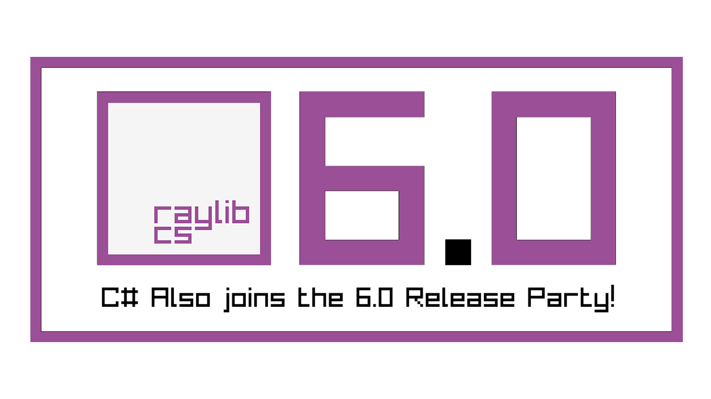
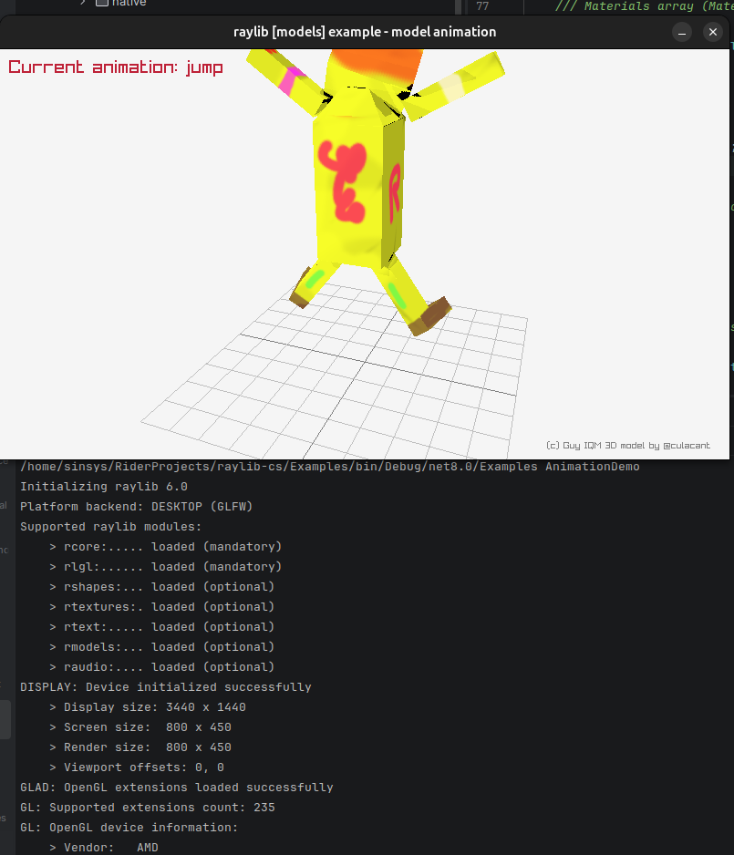

# Raylib-cs 7.0.2 to 8.0.0 update notes



## Before we start: important notice!
At the time of writing, 21 May 2026, the package is not released yet. But because I helped with a large chunk of the upgrade, I thought: let's share what is coming!

## Before we start:
The library targets now .NET 8.0 and .NET 10.0. Why not 11.0? Because 8 and 10 are the latest LTS versions.

## Let's talk about the breaking changes!

### Shaders: ShaderLocationIndex enum

In the enum, `BoneMatrices` is removed and replaced with `BoneTransforms` and `BoneInstanceTransform`.

### Models: Model struct

Because models and animations were redesigned, the struct layout changed!
Later in the document we talk about the new stuff. Let's be negative here. So, `BoneCount` and `Bones` are removed.
They are now in the `ModelSkeleton` struct.

### Models: Mesh struct

Same story as the model struct. The `BoneIds` and `BoneCount` are removed.
They are now in the `ModelSkeleton` struct.

### Core: FilePathList struct
`Capacity` is removed because it did not exist in the original C struct for quite some versions.
Because of this removal, dropping files into the window now works!

### Removed functions in Raylib-cs 8.0.0:

```csharp
// Raylib
void DrawModelPoints(Model model, Vector3 position, float scale, Color tint);
void DrawModelPointsEx(Model model, Vector3 position, Vector3 rotationAxis, float rotationAngle, Vector3 scale, Color tint);
void UnloadModelAnimation(ModelAnimation anim);
void UpdateModelAnimationBones(Model model, ModelAnimation anim, int frame);

// Rlgl

uint CompileShader(sbyte* shaderCode, int type);
uint LoadComputeShaderProgram(uint shaderId);
uint LoadShaderCode(uint vShaderId, uint fShaderId);
```

### Signature changes:
```csharp
// Raylib

// Raylib-cs 7.0.x
CBool ChangeDirectory(sbyte* dir);
// Raylib-cs 8.0.0
CBool ChangeDirectory(sbyte* dirPath);

// Raylib-cs 7.0.x
byte* DecodeDataBase64(byte* data, int* outputSize);
// Raylib-cs 8.0.0
byte* DecodeDataBase64(sbyte* data, int* outputSize);

// Raylib-cs 7.0.x
void DrawCircleGradient(int centerX, int centerY, float radius, Color inner, Color outer);
// Raylib-cs 8.0.0
void DrawCircleGradient(Vector2 center, float radius, Color inner, Color outer);

// Raylib-cs 7.0.x
long GetFileModTime(sbyte* fileName);
// Raylib-cs 8.0.0
CLong GetFileModTime(sbyte* fileName);

// Raylib-cs 7.0.x
FilePathList LoadDirectoryFiles(sbyte* dirPath, int* count);
// Raylib-cs 8.0.0
FilePathList LoadDirectoryFiles(sbyte* dirPath);

// Raylib-cs 7.0.x
int SetRandomSeed(uint seed);
// Raylib-cs 8.0.0
void SetRandomSeed(uint seed);

// Raylib-cs 7.0.x
CBool SetWindowState(ConfigFlags flag);
// Raylib-cs 8.0.0
void SetWindowState(ConfigFlags flag);

// Raylib-cs 7.0.x
sbyte* TextReplace(sbyte* text, sbyte* replace, sbyte* by);
// Raylib-cs 8.0.0
sbyte* TextReplace(sbyte* text, sbyte* search, sbyte* replacement);

// Raylib-cs 7.0.x
void UpdateModelAnimation(Model model, ModelAnimation anim, int frame);
// Raylib-cs 8.0.0
void UpdateModelAnimation(Model model, ModelAnimation anim, float frame);

// RayMath

// Raylib-cs 7.0.x
Vector2 Vector3Angle(Vector3 v1, Vector3 v2);
// Raylib-cs 8.0.0
float Vector3Angle(Vector3 v1, Vector3 v2);

// Rlgl

// Raylib-cs 7.0.x
void BlitFramebuffer();
// Raylib-cs 8.0.0
void BlitFramebuffer(int srcX, int srcY, int srcWidth, int srcHeight, int dstX, int dstY, int dstWidth, int dstHeight, int bufferMask);

// Raylib-cs 7.0.x
uint LoadShaderProgram(uint vShaderId, uint fShaderId);
// Raylib-cs 8.0.0
uint LoadShaderProgram(sbyte* vsCode, sbyte* fsCode);

// Raylib-cs 7.0.x
void SetMatrixProjectionStereo(Matrix4x4 left, Matrix4x4 right);
// Raylib-cs 8.0.0
void SetMatrixProjectionStereo(Matrix4x4 right, Matrix4x4 left);

// Raylib-cs 7.0.x
void SetMatrixViewOffsetStereo(Matrix4x4 left, Matrix4x4 right);
// Raylib-cs 8.0.0
void SetMatrixViewOffsetStereo(Matrix4x4 right, Matrix4x4 left);
```

## Stop being so negative! What's been added in Raylib-cs 8.0.0??

I can tell you a lot! Most are related to file I/O. Here is an overview. This list is mostly for people doing migration work. You probably do not need to memorize it.

```csharp
// Raylib
CBool ColorIsEqual(Color col1, Color col2);
uint* ComputeSHA256(byte* data, int dataSize);
void DrawEllipseLinesV(Vector2 center, float radiusH, float radiusV, Color color);
void DrawEllipseV(Vector2 center, float radiusH, float radiusV, Color color);
void DrawLineDashed(Vector2 startPos, Vector2 endPos, int dashSize, int spaceSize, Color color);
int FileCopy(sbyte* srcPath, sbyte* dstPath);
int FileMove(sbyte* srcPath, sbyte* dstPath);
int FileRemove(sbyte* fileName);
int FileRename(sbyte* fileName, sbyte* fileRename);
int FileTextFindIndex(sbyte* fileName, sbyte* search);
int FileTextReplace(sbyte* fileName, sbyte* search, sbyte* replacement);
int GetDirectoryFileCount(sbyte* dirPath);
int GetDirectoryFileCountEx(sbyte* dirPath, sbyte* filter, CBool scanSubdirs);
sbyte* GetKeyName(KeyboardKey key);
sbyte* GetTextBetween(sbyte* text, sbyte* begin, sbyte* end);
Image LoadImageAnimFromMemory(sbyte* fileType, byte* fileData, int dataSize, int* frames);
sbyte** LoadTextLines(sbyte* text, int* count);
Vector2 MeasureTextCodepoints(Font font, int* codepoints, int length, float fontSize, float spacing);
sbyte* TextInsertAlloc(sbyte* text, sbyte* insert, int position);
sbyte* TextRemoveSpaces(sbyte* text);
sbyte* TextReplaceAlloc(sbyte* text, sbyte* search, sbyte* replacement);
sbyte* TextReplaceBetween(sbyte* text, sbyte* start, sbyte* end, sbyte* replacement);
sbyte* TextReplaceBetweenAlloc(sbyte* text, sbyte* start, sbyte* end, sbyte* replacement);
void UnloadTextLines(sbyte** text, int* lineCount);
void UpdateModelAnimationEx(Model model, ModelAnimation anim, float frame, ModelAnimation animB, float frameB, float blend);

// RayMath

float Vector2CrossProduct(Vector2 v1, Vector2 v2);
Matrix4x4 MatrixMultiplyValue(Matrix4x4 left, float value);
Matrix4x4 MatrixCompose(Vector3 translation, Quaternion rotation, Vector3 scale);

// Rlgl
void DisablePointMode();
uint GetPointSize();
nint GetProcAddress(sbyte* procName);
uint LoadShader(sbyte* vsCode, sbyte* fsCode);
uint LoadShaderProgramCompute(sbyte* shaderCode);
uint LoadShaderProgramEx(uint vShaderId, uint fShaderId);
void SetFramebufferHeight(int height);
void SetFramebufferWidth(int width);
void SetPointSize(float size);
void UnloadShader(uint id);
void rlCopyFramebuffer(uint destFboId, uint srcFboId, int width, int height);
void rlResizeFramebuffer(uint fboId, int width, int height);
```

But to get the full details and improvements for Raylib 6.0, I advise you to read the [release notes](https://github.com/raysan5/raylib/releases/tag/6.0).

## Big improvement! Models and animation!

I have been in contact with people around this, and it was reported that models and animations were not working properly in Raylib-cs 7.0.x.
We do not know yet if it was caused by the C# side or the C side, because the reports mostly involved glTF models.

Also, before 8.0.0, you were required to work with pointers... So we made some changes so it will work with spans.

Look at the old samples:

```csharp
// Loading
Model model = LoadModel("resources/models/iqm/guy.iqm");
Texture2D texture = LoadTexture("resources/models/iqm/guytex.png");
Raylib.SetMaterialTexture(ref model, 0, MaterialMapIndex.Albedo, ref texture);

int animsCount = 0;
var anims = LoadModelAnimations("resources/models/iqm/guyanim.iqm", ref animsCount);
int animFrameCounter = 0;

// Update the animation
animFrameCounter++;
UpdateModelAnimation(model, anims[0], animFrameCounter);

// Draw
DrawModelEx(
    model,
    position,
    new Vector3(1.0f, 0.0f, 0.0f),
    -90.0f,
    new Vector3(1.0f, 1.0f, 1.0f),
    Color.White
);
```

It does not look scary from here. But `LoadModelAnimations` returned a pointer to the animations.

Now... Let's take a look at the new samples:

```csharp
// Loading
Model model = LoadModel("resources/models/iqm/guy.iqm");
Texture2D texture = LoadTexture("resources/models/iqm/guytex.png");
Raylib.SetMaterialTexture(ref model, 0, MaterialMapIndex.Diffuse, ref texture);

var anims = LoadModelAnimations("resources/models/iqm/guyanim.iqm"); // Do you see the change?
float animCurrentFrame = 0.0f;

// Update the animation
animCurrentFrame += 1.0f;
UpdateModelAnimation(model, anims[0], animCurrentFrame);

// Draw
DrawModelEx(
    model,
    position,
    new Vector3(1.0f, 0.0f, 0.0f),
    -90.0f,
    new Vector3(1.0f, 1.0f, 1.0f),
    Color.White
);
```

Yes, it is a very small change in this example. But the big difference is that `anims` now is a `Span<ModelAnimation>`, which can be iterated easily, searched, and used without touching pointers directly.

Small note: this is still native memory. Use `UnloadModelAnimations(anims)` when you are done.

### But wait! There is more! You want to get the animations based on the name?

Look at this example that shows the current animation:

```csharp
DrawText($"Current animation: {anims[animIndex].NameToString()}", 10, 10, 20, Color.Maroon);
```

You can see that `NameToString()` is added. This converts the fixed native name to a C# string. What can you do with this? Well! Now you can search for the animation or cache it! Instead of relying on unstable indexes, you can use the animation name!



## Other QoL changes: new wrapper functions instead of pointers!

Here is the "cheat sheet" for the new functions:

```csharp
/// <summary>Set icon for window (multiple images, RGBA 32bit)</summary>
void SetWindowIcons(Image[] images);

/// <summary>Load image sequence from memory buffer</summary>
Image LoadImageAnimFromMemory(string fileType, byte[] fileData, out int frames);

/// <summary>Export data to code (.h), returns true on success</summary>
CBool ExportDataAsCode(byte[] data, string fileName);

/// <summary>Load model animations from file</summary>
Span<ModelAnimation> LoadModelAnimations(string fileName);

void UnloadModelAnimations(Span<ModelAnimation> animations);

/// <summary>Update sound buffer with new data</summary>
void UpdateSound<T>(Sound sound, ReadOnlySpan<T> data, int sampleCount) where T : unmanaged;

/// <summary>Update sound buffer with new data</summary>
void UpdateSound<T>(Sound sound, ReadOnlySpan<T> data) where T : unmanaged;

/// <summary>Update audio stream buffers with data</summary>
void UpdateAudioStream<T>(AudioStream sound, ReadOnlySpan<T> data, int frameCount) where T : unmanaged;

/// <summary>Draw multiple characters (codepoint)</summary>
void DrawTextCodepoints(Font font, int[] codepoints, Vector2 position, float fontSize, float spacing, Color tint);

/// <summary>Measure string size for Font</summary>
Vector2 MeasureTextCodepoints(Font font, int[] codepoints, float fontSize, float spacing);

/// <summary>Rename file (if exists)</summary>
int FileRename(string filename, string fileRename);

/// <summary>Remove file (if exists)</summary>
int FileRemove(string filename);

/// <summary>Copy file from one path to another, dstPath created if it doesn't exist</summary>
int FileCopy(string srcPath, string dstPath);

/// <summary>Move file from one path to another, dstPath created if it doesn't exist</summary>
int FileMove(string srcPath, string dstPath);

/// <summary>Replace text in an existing file</summary>
int FileTextReplace(string fileName, string search, string replacement);

/// <summary>Find text in existing file</summary>
int FileTextFindIndex(string fileName, string search);

/// <summary>Check if file exists</summary>
CBool FileExists(string fileName);

/// <summary>Check if a directory path exists</summary>
CBool DirectoryExists(string dirPath);

/// <summary>Get file length in bytes</summary>
int GetFileLength(string fileName);

/// <summary>Get string to extension for a filename string (includes dot: '.png')</summary>
string GetFileExtension(string fileName);

/// <summary>Get string to filename for a path string</summary>
string GetFileName(string fileName);

/// <summary>Get filename string without extension </summary>
string GetFileNameWithoutExt(string fileName);

/// <summary>Get full path for a given fileName with path</summary>
string GetDirectoryPath(string filePath);

/// <summary>Get previous directory path for a given path</summary>
string GetPrevDirectoryPath(string dirPath);

/// <summary>Get current working directory</summary>
string GetWorkingDirectoryAsString();

/// <summary>Get the directory of the running application</summary>
string GetApplicationDirectoryAsString();

/// <summary>Change working directory, return true on success</summary>
CBool ChangeDirectory(string dirPath);

/// <summary>Check if a given path is a file or a directory</summary>
CBool IsPathFile(string path);

/// <summary>Load directory filepaths</summary>
FilePathList LoadDirectoryFiles(string dirPath);

/// <summary>Get the file count in a directory</summary>
int GetDirectoryFileCount(string dirPath);

/// <summary>Get the file count in a directory with extension filtering and recursive directory scan. Use 'DIR' in the filter string to include directories in the result</summary>
int GetDirectoryFileCountEx(string dirPath, string filter, CBool scanSubdirs);

/// <summary>Load directory filepaths with extension filtering and subdir scan; some filters available: "*.*", "FILES*", "DIRS*"</summary>
FilePathList LoadDirectoryFilesEx(string basePath, string filter, CBool scanSubDirs);

/// <summary>Compress data (DEFLATE algorithm)</summary>
byte[] CompressData(byte[] data);

/// <summary>Decompress data (DEFLATE algorithm)</summary>
byte[] DecompressData(byte[] data);

/// <summary>Encode data to Base64 string</summary>
byte[] EncodeDataBase64(byte[] data);

/// <summary>Decode data to Base64 string</summary>
byte[] DecodeDataBase64(string data);

/// <summary>Compute CRC32 hash code</summary>
uint ComputeCRC32(byte[] data);

/// <summary>Compute MD5 hash code, returns uint[4] array</summary>
uint[] ComputeMD5(byte[] data);

/// <summary>Compute SHA1 hash code, returns uint[5] array</summary>
uint[] ComputeSHA1(byte[] data);

/// <summary>Compute SHA256 hash code, returns uint[8] (32 bytes)</summary>
uint[] ComputeSHA256(byte[] data);
```

## TL;DR
- Breaking struct/layout changes for models, mesh, and file path lists
- New file I/O functions
- New model and animation API changes
- New QoL wrapper functions that avoid pointers in common C# usage
- Raylib-cs 8.0.0 aligns better with Raylib 6.0