# Raylib-cs textures for 2D games and simple animations!

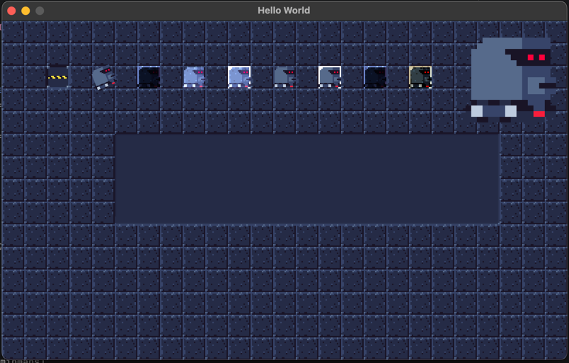

## Introduction

In this tutorial, we will cover the basics of textures and simple animations.
This also includes a simple introduction to timers. Those timers can be used for
a lot of other things once you see the power of them.

Also, in this tutorial I will give you a spritesheet with 16x16 sprites.
If you want to use your own spritesheet, that is fine, but keep in mind that
the examples and mapping are based on this one. My recommendation is to
use the same spritesheet while following along. After you have
finished this tutorial, you will have the basic knowledge to start using your own
sprites and make awesome games!

**Note:** I will only cover basic rendering here. There are also functions for
image manipulation, shaders, render textures, and more. If you are interested in those, please
let me know. Otherwise, I suggest checking out the Raylib-cs examples:
https://github.com/raylib-cs/raylib-cs/tree/main/Examples/Textures

One thing is for sure: **It will be awesome and fun!**

But first, let's go to the boring part...

## Prerequisites

- You should have a basic understanding of C# and Raylib-cs.
- You should know how to load assets in your project.
- You need a spritesheet with animations from left to right in a grid.

If you do not, I made a tutorial for you! Check it here: [Getting started](gettingstarted.md)

## Let's get started! Set up the project

Make a console project and add the Raylib-cs package. Your project should look like this:

```csharp
using Raylib_cs;

namespace HelloWorld;

internal static class Program
{
    // STAThread is required if you deploy using NativeAOT on Windows.
    // See: https://github.com/raylib-cs/raylib-cs/issues/301
    [System.STAThread]
    public static void Main()
    {
        Raylib.InitWindow(800, 480, "Hello World");

        while (!Raylib.WindowShouldClose())
        {
            Raylib.BeginDrawing();
            Raylib.ClearBackground(Color.Black);

            Raylib.EndDrawing();
        }

        Raylib.CloseWindow();
    }
}
```

Before you update the csproj file, first create a folder called `Assets` in your project root.
Then place the following PNG image (`Sprites.png`) inside it:

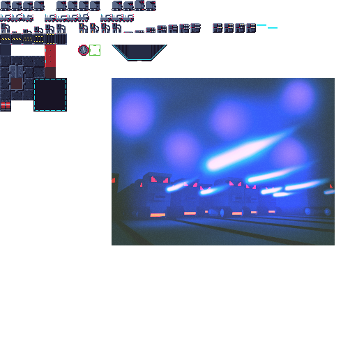

**Fun fact:** I created this sprite set myself during a course I took. Feel free to use it! I don't really use it anymore.

Your project csproj file should look like this:

```xml
<Project Sdk="Microsoft.NET.Sdk">

    <PropertyGroup>
        <OutputType>Exe</OutputType>
        <TargetFramework>net10.0</TargetFramework>
        <ImplicitUsings>enable</ImplicitUsings>
        <Nullable>enable</Nullable>
    </PropertyGroup>

    <ItemGroup>
      <PackageReference Include="Raylib-cs" Version="7.0.2" />
    </ItemGroup>

    <ItemGroup>
        <Compile Remove="Assets/**/*"/>
    </ItemGroup>

    <ItemGroup>
        <Content Include="Assets/**/*.*">
            <CopyToOutputDirectory>PreserveNewest</CopyToOutputDirectory>
        </Content>
    </ItemGroup>
</Project>
```

### Why a spritesheet and not separate images?
When you use textures in general, it's best to group them in a spritesheet.
This is also sometimes called an **atlas**. This is more performant because
it helps with batching draw calls.

Also, this is my opinion, but it is easier to work with. With some helpers,
you will see why.

## Before we start, allow me to introduce the draw texture calls

Here is a copy and paste from the cheat sheet, reformatted a bit:

Draw a Texture2D:

`Raylib.DrawTexture(Texture2D texture, int posX, int posY, Color tint);`

Draw a Texture2D with position defined as Vector2:

`Raylib.DrawTextureV(Texture2D texture, Vector2 position, Color tint);`

Draw a Texture2D with extended parameters:

`Raylib.DrawTextureEx(Texture2D texture, Vector2 position, float rotation, float scale, Color tint);`

Draw a part of a texture defined by a rectangle:

`Raylib.DrawTextureRec(Texture2D texture, Rectangle source, Vector2 position, Color tint);`

Draw a part of a texture defined by a rectangle with 'pro' parameters:

`Raylib.DrawTexturePro(Texture2D texture, Rectangle source, Rectangle dest, Vector2 origin, float rotation, Color tint);`

Draws a texture (or part of it) that stretches or shrinks nicely:

`Raylib.DrawTextureNPatch(Texture2D texture, NPatchInfo nPatchInfo, Rectangle dest, Vector2 origin, float rotation, Color tint);`

Most of them are self-explanatory, but the most important one here is `DrawTexturePro`. That function allows you to rotate, scale, and specify the origin.
With a spritesheet, this is very useful.

Another very powerful one is `DrawTextureNPatch`. This is handy for UI elements and similar things.

### ALRIGHT!! Enough lectures. Where is the code?

Put your shirt on, Sparky! :p But seriously, let's get into the code!

## Let's load in the spritesheet

Like in the Hello World example, we are going to use the struct wrapper for loading and unloading the texture. Grab the following code and place it below `Program.cs`:

```csharp
public readonly struct RaylibTexture : IDisposable
{
    public readonly Texture2D Texture;

    public RaylibTexture(string path, TextureFilter filter = TextureFilter.Point)
    {
        Texture = Raylib.LoadTexture(path);
        Raylib.SetTextureFilter(Texture, filter);
    }

    public static implicit operator Texture2D(RaylibTexture texture)
    {
        return texture.Texture;
    }

    public void Dispose()
    {
        Raylib.UnloadTexture(Texture);
    }
}
```

Then let's load the spritesheet:

```csharp
using var spriteAtlas = new RaylibTexture("Assets/Sprites.png", TextureFilter.Point);
```

### But wait a minute! What is the TextureFilter??
For the sharp readers who also read the Hello World example, you may notice the `Raylib.SetTextureFilter(Texture, filter);` call. What is that?

Let's take a look at the enum from Raylib-cs:

```csharp
public enum TextureFilter
{
    /// <summary>
    /// No filter, just pixel aproximation
    /// </summary>
    Point = 0,

    /// <summary>
    /// Linear filtering
    /// </summary>
    Bilinear,

    /// <summary>
    /// Trilinear filtering (linear with mipmaps)
    /// </summary>
    Trilinear,

    /// <summary>
    /// Anisotropic filtering 4x
    /// </summary>
    Anisotropic4X,

    /// <summary>
    /// Anisotropic filtering 8x
    /// </summary>
    Anisotropic8X,

    /// <summary>
    /// Anisotropic filtering 16x
    /// </summary>
    Anisotropic16X,
}
```

Basic rule of thumb: use `Point` for pixel art. If you do not scale the image and you want nicer rotations, like in RimWorld or Prison Architect, then use `Bilinear` or even `Trilinear`.

You always do this after loading the texture. Then you mark it with this filter type.

## Let's draw the spritesheet

Alright, to draw the spritesheet, we will draw this robot:

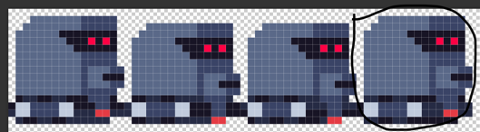

You need to use the `DrawTexturePro` function. Here is an example of how to do it. Put this in the draw loop:

```csharp
var source = new Rectangle(48, 0, 16, 16);
var destination = new Rectangle(32, 32, 16, 16);

Raylib.DrawTexturePro(
            spriteAtlas, 
            source, 
            destination, 
            Vector2.Zero, 
            0, 
            Color.White);
```

Look at that, we have a robot!!!

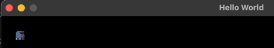

### Cool, how about rotation? Ok, let's rotate by 45 degrees. Important! Raylib uses degrees, not radians!!

```csharp
var source = new Rectangle(48, 0, 16, 16);
var destination = new Rectangle(32, 32, 16, 16);

Raylib.DrawTexturePro(
            spriteAtlas, 
            source, 
            destination, 
            Vector2.Zero, 
            45, 
            Color.White);
```

**Tip:** If you want to convert radians to degrees, you can use the following function:

```csharp
float RadiansToDegrees(float radians)
{
    return radians * (180f / MathF.PI);
}
```

Anyway, if you start the game now, you will see it rotating from the wrong orientation. As an example, I rendered it 4 times with 0, 45, 90, and 135 degrees:

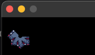

This is because the origin is set to `Vector2.Zero`. I did this on purpose to show the importance of the origin. For the origin to work correctly,
you need to set half the width and height of the **destination** rectangle. Why the destination? If you scale the image, it will otherwise be off again.
Alright, let's address this:

```csharp
Raylib.DrawTexturePro(
                spriteAtlas, 
                source, 
                destination, 
                destination.Size * 0.5f, 
                45, 
                Color.White);
```

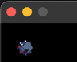

### Scaling! Because it's too small!!!

Well, to scale the image, you can change the destination rectangle size. Easy as that:

```csharp
// from
var destination = new Rectangle(32, 32, 16, 16);
// to
var destination = new Rectangle(32, 32, 32, 32);
```

Let's run the game and see what happens:

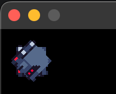

OEHH, it's a big robot! Well... kinda. But it's still larger :p

But if you have many sprites that need to be scaled up, I do not recommend doing it this way. For that, you have 2 options:

- Use the `Camera2D` to scale the image. I will explain that next!
- Use a `RenderTexture2D`. I will explain that in another tutorial.

Before we explain the camera, revert the destination rectangle to the original size:
```csharp
// from
var destination = new Rectangle(32, 32, 16, 16);
```

### Use the Camera2D to do a global scale!

Alright, after this:

```csharp
Raylib.InitWindow(800, 480, "Hello World");
```

Add the following code:

```csharp
var camera = new Camera2D();
camera.Zoom = 2;
```

Those are the camera settings. We are now telling the camera to scale the image by 2. But to use the camera, you also need to call `Raylib.BeginMode2D(camera);` and `Raylib.EndMode2D();` inside the draw loop.
So, the draw loop should look like this:

```csharp
while (!Raylib.WindowShouldClose())
{
    Raylib.BeginDrawing();
    Raylib.BeginMode2D(camera);
    Raylib.ClearBackground(Color.Black);
    
    var source = new Rectangle(48, 0, 16, 16);
    var destination = new Rectangle(32, 32, 32, 32);
    
    Raylib.DrawTexturePro(
        spriteAtlas, 
        source, 
        destination, 
        destination.Size * 0.5f, 
        45, 
        Color.White);
    
    Raylib.EndMode2D();
    Raylib.EndDrawing();       
}
```

If you now run the game, everything is scaled up! Well... only one lonely robot.

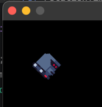

### Serious talk. The draw function...

If you look at this:

```csharp
var source = new Rectangle(48, 0, 16, 16);
var destination = new Rectangle(32, 32, 16, 16);

Raylib.DrawTexturePro(
                spriteAtlas, 
                source, 
                destination, 
                destination.Size * 0.5f, 
                45, 
                Color.White);
```

It is tough to understand WHAT you are drawing here. Now imagine you look at the following code:

```csharp
for (var x = 0; x < windowSize.X / GRID_SIZE; x++)
{
    for (var y = 0; y < windowSize.Y / GRID_SIZE; y++)
    {
        var position = new Vector2(x, y) * GRID_SIZE;
        SpriteSet[Sprites.Wall].Draw(position, Color.White);
    }
}

SpriteSet[Sprites.Gate].Draw(new Vector2(GRID_SIZE * 2, GRID_SIZE * 2), Color.White, gateFrame);

SpriteSet[Sprites.Robot].Draw(new Vector2(GRID_SIZE * 4, GRID_SIZE * 2), Color.White, rotation: rotation);
```

Here you can actually see what you are drawing. The code is self-explanatory because you no longer need to know where the source rectangle is. Also,
the enum explains what kind of sprite you are drawing. Do you like what you see? Alright, let's go to the next section!

## Sprite atlas management!

To do this, we need a struct to define where the source sprite is. Then we also wrap the `DrawTexturePro` call. Like this:

```csharp
public readonly struct SpriteInfo
{
    public readonly RaylibTexture Texture;
    public readonly Rectangle Rectangle;
    
    public SpriteInfo(RaylibTexture texture, Rectangle rectangle)
    {
        Texture = texture;
        Rectangle = rectangle;
    }
    
    public SpriteInfo(RaylibTexture texture, int x, int y, int width, int height, int gridSize = 1)
    {
        Texture = texture;
        Rectangle = new Rectangle(x * gridSize, y * gridSize, width * gridSize, height * gridSize);
        TotalFrames = totalFrames;
    }
    
    [MethodImpl(MethodImplOptions.AggressiveInlining)]
    public void Draw(Vector2 position, Color color, int frame = 0, float scale = 1, float rotation = 0)
    {
        Raylib.DrawTexturePro(
            Texture, 
            Rectangle, 
            new Rectangle(position.X, position.Y, Rectangle.Width * scale, Rectangle.Height * scale), 
            new Vector2(Rectangle.Width / 2, Rectangle.Height / 2) * scale, 
            rotation, 
            color);
    }
}
```

### Wait what is this `[MethodImpl(MethodImplOptions.AggressiveInlining)]`??
This is a compiler hint. Because we are working in a hot loop here, we want to make sure that the compiler is not making an unnecessary function call. The difference
is small, but it can still help with performance. But DON'T USE IT ANYWHERE! It is only useful for small functions. If the function body becomes too large,
it can lose the benefits.

### Why this constructor? `public SpriteInfo(RaylibTexture texture, int x, int y, int width, int height, int gridSize = 1)`?
When filling all the sprites in code, you can use the grid size. Positions 1, 2, and 3 say more than 16, 32, and 48 pixels.

### Alright let's use it!

First, at the bottom of the `Program.cs` file, add the following enum to specify the sprites:
```csharp
public enum Sprites
{
    Robot,
    Gate,
    Floor,
    Wall
}
```

We will only use Robot for now. Later on we will add more.

Then let's add a dictionary to store the sprites:

```csharp
internal static class Program
{
    public static readonly Dictionary<Sprites, SpriteInfo> SpriteSet = new();
    
    // Other code...
```

After loading the spritesheet, add the following:
```csharp
using var spriteAtlas = new RaylibTexture("Assets/Sprites.png", TextureFilter.Point);
// Add this:
const int GRID_SIZE = 16;
SpriteSet[Sprites.Robot] = new SpriteInfo(spriteAtlas, 0, 0, 1, 1, GRID_SIZE);
```

Now you can see that we are loading the sprite at position 0, 0 with a size of 16x16. Way easier, right?

### Hold on... what is this GRID_SIZE?
Welcome to the programming world. You want to prevent magic numbers, so we use a constant. It also makes the code more readable.

### Let's draw the robot!
Add this within the Camera2D:

```csharp
SpriteSet[Sprites.Robot].Draw(new Vector2(GRID_SIZE * 4, GRID_SIZE * 2), Color.White, rotation: 45);
```

If you now run the game, it should almost look the same as before. The only difference is the location.

## A black background is boring. Can we do something better?

Yes! Let's add another sprite to the dictionary:

```csharp
SpriteSet[Sprites.Floor] = new SpriteInfo(spriteAtlas, 0, 4, 1, 1, GRID_SIZE);
SpriteSet[Sprites.Wall] = new SpriteInfo(spriteAtlas, 3, 5, 1, 1, GRID_SIZE);

// Also add this after the camera setup:

var windowSize = new Vector2(Raylib.GetScreenWidth(), Raylib.GetScreenHeight()) / camera.Zoom;
```

Here we mapped the sprites to a floor sprite and a wall sprite.

### Wait, what is this windowSize?
Here we get the window size and divide it by the camera zoom. Because we zoom in with the camera, the viewport is divided by that zoom.

### Let's draw the floor!
Alright, let's draw the floor before the robot:

```csharp
// First:
Raylib.ClearBackground(Color.Black);
         
// Then directly after:            
for (var x = 0; x < windowSize.X / GRID_SIZE; x++)
{
    for (var y = 0; y < windowSize.Y / GRID_SIZE; y++)
    {
        var position = new Vector2(x, y) * GRID_SIZE;
        SpriteSet[Sprites.Floor].Draw(position, Color.White);
    }
}
```

Here we are filling the whole screen with the floor tile. Let's run the game and see what happens:

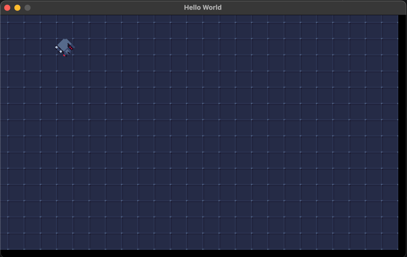

It works!! But what are those black bars on the right and bottom? Ahh yes! That is because we are setting the origin to the center of the sprite.
We could make a special draw call that always starts from the top-left, but I do not recommend that. Why? You want to keep the logic as consistent as possible. Otherwise, it can lead to nasty bugs.

So an easier fix is to offset the camera :D Let's change the camera setup to:

```csharp
var camera = new Camera2D();
camera.Zoom = 2;
camera.Offset = new Vector2(GRID_SIZE, GRID_SIZE); // <-- This is the fix!
```

Why `GRID_SIZE` and not half? Because the zoom multiplies the offset.

If you now run the game, the black bars are gone!

## Alright, let's animate!

We are going to animate the following sprites:

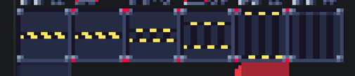

But are we manually going to set all those 6 rectangles? NO! We are going to use an X offset! But first, we need to make changes to the struct:

```csharp
public readonly struct SpriteInfo
{
    public readonly RaylibTexture Texture;
    public readonly Rectangle Rectangle;
    public readonly int TotalFrames; // <-- This is new!
    
    public SpriteInfo(RaylibTexture texture, Rectangle rectangle, int totalFrames = 1) //<-- This is new!
    {
        Texture = texture;
        Rectangle = rectangle;
        TotalFrames = totalFrames; //<-- This is new!
    }
    
    public SpriteInfo(RaylibTexture texture, int x, int y, int width, int height, int gridSize = 1, int totalFrames = 1) //<-- This is new!
    {
        Texture = texture;
        Rectangle = new Rectangle(x * gridSize, y * gridSize, width * gridSize, height * gridSize);
        TotalFrames = totalFrames; //<-- This is new!
    }
    
    [MethodImpl(MethodImplOptions.AggressiveInlining)]
    public void Draw(Vector2 position, Color color, int frame = 0, float scale = 1, float rotation = 0) //<-- This is new!
    {
        Raylib.DrawTexturePro(
            Texture, 
            new Rectangle(Rectangle.X + frame * Rectangle.Width, Rectangle.Y, Rectangle.Width, Rectangle.Height),  //<-- This is new!
            new Rectangle(position.X, position.Y, Rectangle.Width * scale, Rectangle.Height * scale), 
            new Vector2(Rectangle.Width / 2, Rectangle.Height / 2) * scale, 
            rotation, 
            color);
    }
    
}
```

The trick is that we can now store the total frames. Then, by multiplying the frame with the width of the rectangle, we can get the correct frame!
I am not saying this is the best way to do it, but in most cases this is enough.

But before we can implement the animation, we also need to add some utilities. We need timers!

## Timers!
Add this in a new file called `Timers.cs`:

```csharp
public static class Timers
{
    // Here we can change the value based on the deltatime until the interval is reached. Then it will start again.
    public static bool FixedTimer(ref float elapsed, float intervalInSeconds, float deltaTime)
    {
        elapsed += deltaTime;
        if (elapsed < intervalInSeconds)
            return false;
        elapsed = 0;
        return true;
    }
    
    // Here we can convert the normal from 0 to 1, to 0 to 1 then back to 0
    public static float NormalToUpDown(float normal)
    {
        if (normal < 0.5f)
            return Math.Min(1, normal * 2f);

        return Math.Max(0, 1 - (normal - 0.5f) * 2);
    }


    // This will normalize the time to 0 to 1. Which is easier for calculations.
    public static float TimerNormal(float elapsed, float total)
    {
        return Math.Clamp((elapsed + float.Epsilon) / total, 0, 1);
    }

    // This will return the "frame" for our animation based on the timer.
    public static int TimerStepValue(float normal, int maxSteps)
    {
        return Math.Clamp((int)(normal * maxSteps), 0, maxSteps - 1);
    }
}
```

I added some comments to explain what those functions do. But why normalize the time? Because we want to use the same values for the animation. Then it does not matter if the animation is 100 frames long or 1000 frames long, because we are always using 0 to 1.

### Implement the animation with timers!

Alright, let's register the sprite animation and the animation float values:

```csharp
SpriteSet[Sprites.Gate] = new SpriteInfo(spriteAtlas, 0, 3, 1, 1, GRID_SIZE, 6);

var gateTime = 0f;
var gateDuration = 1f; // Means the animation will run for 1 second
```

With the **6**, we are saying that the gate has 6 frames.

Alright let's get the frame:

```csharp
// After:
while (!Raylib.WindowShouldClose())

// Add the following:        


// First we need to get the delta time
var deltaTime = Raylib.GetFrameTime();
// Let's update the timer 
Timers.FixedTimer(ref gateTime, gateDuration, deltaTime);
// Normalize the time to 0 to 1
var normalizedTime = Timers.TimerNormal(gateTime, gateDuration);
// For fun let loop the animation from 0 to 1 then back to 0
var normalizedUpDown = Timers.NormalToUpDown(normalizedTime);
// Convert the normalized value to a frame. So 0 = 0, and 1 = 5. Yes total frames - 1!
var gateFrame = Timers.TimerStepValue(normalizedUpDown, SpriteSet[Sprites.Gate].TotalFrames);
```

Now we can draw the gate with the following code. Do this after the floor rendering:

```csharp
SpriteSet[Sprites.Gate].Draw(new Vector2(GRID_SIZE * 2, GRID_SIZE * 2), Color.White, gateFrame);
```

Let's run the game and see what happens:

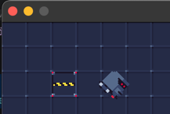

If my calculations are correct, this door closes at 88 miles a second! No, I am just joking. It should be around 1 second for opening and closing.

But the fun part is that you can also use this for rotation! Let's rotate the robot:

Add the following variables after the gate variables:

```csharp
var rotationTime = 0f;
var rotationDuration = 1f;
```

Then after the gate calculations add the following:
```csharp
Timers.FixedTimer(ref rotationTime, rotationDuration, deltaTime);            
var rotation = Timers.TimerNormal(rotationTime, rotationDuration) * 360;
```

Then replace the 45 with the rotation value:

```csharp
SpriteSet[Sprites.Robot].Draw(new Vector2(GRID_SIZE * 4, GRID_SIZE * 2), Color.White, rotation: rotation);
```

Run it again and you will see the robot spinning around! But do you see how flexible this is? There are so many use cases for this. Think of:
- Animating a door
- State machine duration
- Animation sequence
- Go nuts!

## Alright the DrawTextureNPatch!

Because this tutorial is starting to become long, I will keep this short. To use this, you need to add a struct with config. Here is an example:

```csharp
var patchInfo = new NPatchInfo
{
    Layout = NPatchLayout.NinePatch,
    Bottom = 1,
    Left = 1,
    Right = 1,
    Top = 1,
    Source = SpriteSet[Sprites.Floor].Rectangle,
};
```

Here we are using 1 around the tile, and in the middle we are stretching the tile.

The options are:
```csharp
public enum NPatchLayout
{
    /// <summary>
    /// Npatch defined by 3x3 tiles
    /// </summary>
    NinePatch = 0,

    /// <summary>
    /// Npatch defined by 1x3 tiles
    /// </summary>
    ThreePatchVertical,

    /// <summary>
    /// Npatch defined by 3x1 tiles
    /// </summary>
    ThreePatchHorizontal
}
```

To render it, it is as easy as:

```csharp
Raylib.DrawTextureNPatch(
                spriteAtlas, 
                patchInfo, 
                new Rectangle(halfGridSize + new Vector2(64, 64), 
                    new Vector2(windowSize.X - 128, 64)), 
                Vector2.Zero, 0, Color.White);
```

If we change the background tiles to wall, then we should see the following:

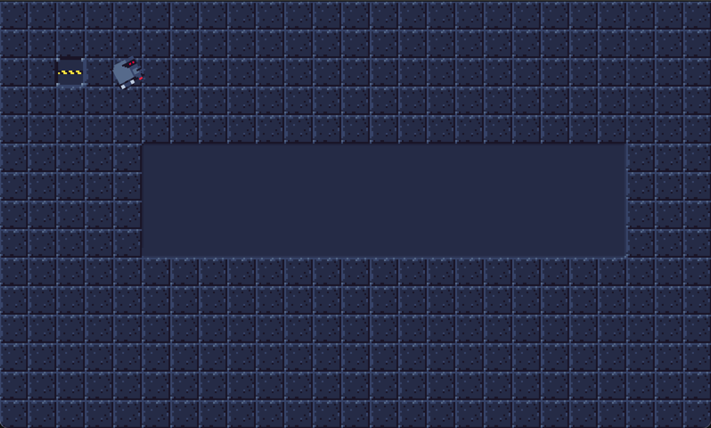

You can see that this is very handy for UI elements and special tiles.

## Last part: blending modes!

Before you render a texture, you can set the blending mode. That means how it reacts to the background. There are the following options:

```csharp
public enum BlendMode
{
    /// <summary>
    /// Blend textures considering alpha (default)
    /// </summary>
    Alpha = 0,

    /// <summary>
    /// Blend textures adding colors
    /// </summary>
    Additive,

    /// <summary>
    /// Blend textures multiplying colors
    /// </summary>
    Multiplied,

    /// <summary>
    /// Blend textures adding colors (alternative)
    /// </summary>
    AddColors,

    /// <summary>
    /// Blend textures subtracting colors (alternative)
    /// </summary>
    SubtractColors,

    /// <summary>
    /// Blend premultiplied textures considering alpha
    /// </summary>
    AlphaPremultiply,

    /// <summary>
    /// Blend textures using custom src/dst factors (use rlSetBlendFactors())
    /// </summary>
    Custom,

    /// <summary>
    /// Blend textures using custom rgb/alpha separate src/dst factors (use rlSetBlendFactorsSeparate())
    /// </summary>
    CustomSeparate
}
```

Those can be very fun for shield effects or other cool stuff.

But to use them, it is as easy as:

```csharp
Raylib.BeginBlendMode(BlendMode.Additive);
SpriteSet[Sprites.Robot].Draw(new Vector2(GRID_SIZE * 8, GRID_SIZE * 2), Color.White);
Raylib.EndBlendMode();
```

Then, if you use them all except `Custom` and `CustomSeparate`:

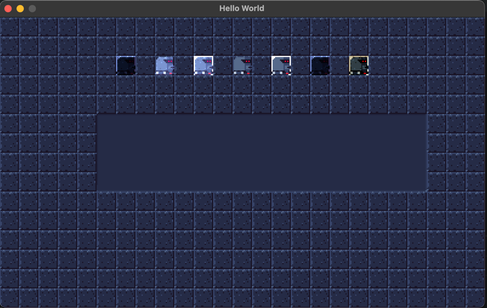

With the following code:

```csharp
Raylib.BeginBlendMode(BlendMode.Multiplied);
SpriteSet[Sprites.Robot].Draw(new Vector2(GRID_SIZE * 6, GRID_SIZE * 2), Color.White);
Raylib.EndBlendMode();

Raylib.BeginBlendMode(BlendMode.Additive);
SpriteSet[Sprites.Robot].Draw(new Vector2(GRID_SIZE * 8, GRID_SIZE * 2), Color.White);
Raylib.EndBlendMode();

Raylib.BeginBlendMode(BlendMode.AddColors);
SpriteSet[Sprites.Robot].Draw(new Vector2(GRID_SIZE * 10, GRID_SIZE * 2), Color.White);
Raylib.EndBlendMode();

Raylib.BeginBlendMode(BlendMode.Alpha);
SpriteSet[Sprites.Robot].Draw(new Vector2(GRID_SIZE * 12, GRID_SIZE * 2), Color.White);
Raylib.EndBlendMode();

Raylib.BeginBlendMode(BlendMode.AlphaPremultiply);
SpriteSet[Sprites.Robot].Draw(new Vector2(GRID_SIZE * 14, GRID_SIZE * 2), Color.White);
Raylib.EndBlendMode();

Raylib.BeginBlendMode(BlendMode.Multiplied);
SpriteSet[Sprites.Robot].Draw(new Vector2(GRID_SIZE * 16, GRID_SIZE * 2), Color.White);
Raylib.EndBlendMode();

Raylib.BeginBlendMode(BlendMode.SubtractColors);
SpriteSet[Sprites.Robot].Draw(new Vector2(GRID_SIZE * 18, GRID_SIZE * 2), Color.White);
Raylib.EndBlendMode();
```

You can see the different blending modes!

## TL;DR
- Spritesheets are great for animations
- Timers are great for animations
- NPatch is great for UI elements
- Blend modes are great for special effects

Thank you for reading!
